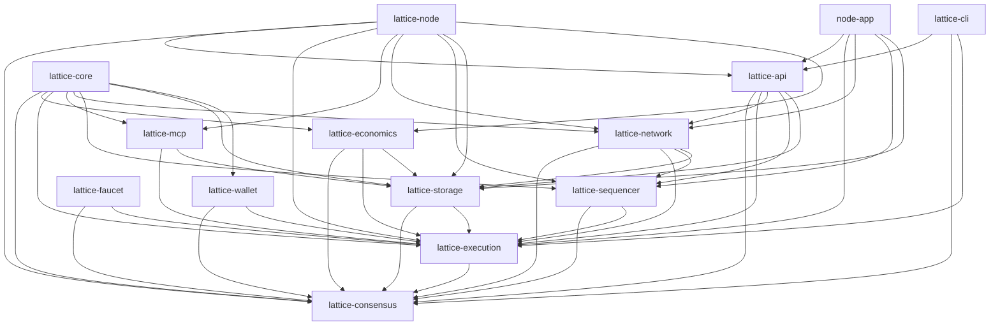
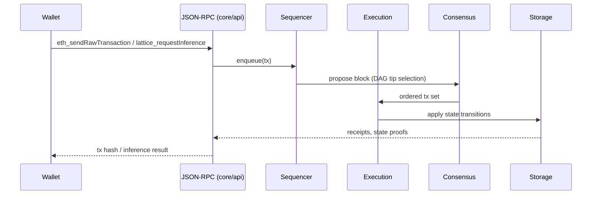

# Lattice Network (v3) – Monorepo

A Layer‑1, AI‑native BlockDAG with Ethereum‑compatible JSON‑RPC, model registration and inference flows, and a desktop GUI. This monorepo hosts the node, CLI, SDK(s), GUI (Tauri), explorer, docs portal, and supporting scripts.

> License: MIT — contributions welcome via GitHub Pull Requests (see Contributing below).

## Contents

- lattice-v3/ — Rust workspace (node, core crates, CLI, wallet, faucet)
- lattice-v3/gui/lattice-core — Desktop GUI (Tauri + React + Vite)
- lattice-v3/explorer — Web explorer (Next.js)
- lattice-v3/sdk/javascript — TypeScript SDK (ethers‑based)
- docs-portal — Docusaurus documentation site
- marketing-site — Next.js site (includes /downloads)
- scripts — Local dev/testnet helpers

## Quickstart

Prerequisites
- Rust toolchain (stable) and Cargo
- Node.js >= 20 and npm
- (Optional) Foundry (forge) for Solidity tests: `curl -L https://foundry.paradigm.xyz | bash`

Build everything
```bash
# Rust workspace
cd lattice-v3
cargo build --workspace
cargo test --workspace

# GUI (web build) and Desktop app (Tauri)
cd ../lattice-v3/gui/lattice-core
npm ci
npm run build              # web build to dist/
npm run tauri              # run desktop app (dev)
# or: npm run tauri:build  # produce installers/bundles

# Explorer (Next.js)
cd ../../explorer
npm ci && npm run build

# Docs (Docusaurus)
cd ../../../docs-portal
npm install && npm run build
```

Run a single‑node devnet
```bash
# Start node (JSON‑RPC :8545)
cd lattice-v3
cargo run -p lattice-node -- devnet

# In another terminal, smoke test RPC
curl -s http://127.0.0.1:8545 -H 'content-type: application/json' \
  -d '{"jsonrpc":"2.0","method":"eth_blockNumber","params":[],"id":1}' | jq
```

Desktop GUI attached to a local node
```bash
cd lattice-v3/gui/lattice-core
npm run tauri
```

Downloads (prebuilt)
- See marketing /downloads page (links latest GitHub release assets):
  - File: `marketing-site/pages/downloads.tsx`
  - Hosted: https://github.com/lattice-network/lattice-v3/releases/latest

## Monorepo Structure

- lattice-v3/Cargo.toml — Rust workspace config (core crates and binaries)
- Core crates under `lattice-v3/core/`:
  - consensus, execution, storage, network, sequencer, api, mcp, economics, primitives
- Binaries
  - `lattice-v3/node` — the blockchain node (binary: `lattice`)
  - `lattice-v3/cli` — CLI tool (binary: `lattice-cli`)
  - `lattice-v3/wallet` — wallet binary (dev utilities)
- GUI
  - `lattice-v3/gui/lattice-core` — Tauri app; invokes node operations and displays DAG
- Explorer
  - `lattice-v3/explorer` — Next.js app plus indexer scripts
- SDK
  - `lattice-v3/sdk/javascript` — TypeScript SDK
- Documentation
  - `docs-portal` — Docusaurus site (developer docs, RPC, guides)
  - `lattice-docs-v3` — whitepaper and archival docs
- Scripts
  - `scripts/lattice.sh` — single entrypoint for setup/build/dev/docker/logs

## Network Modes & Config

- Node TOML configs: `lattice-v3/node/config/` (devnet/testnet samples)
- GUI JSON configs: `lattice-v3/gui/lattice-core/config/devnet.json`, `.../testnet.json`
- Switching networks in GUI updates ports, discovery, and `chainId` automatically.

## Architecture (Mermaid)


mermaid```
flowchart LR
    subgraph Clients_&_Tools
        CLI[CLI\ncli/]
        Wallet[Wallet App\nwallet/]
        GUI[GUI & Explorer\nnode-app/, gui/, explorer/]
        SDK[SDKs & Scripts\nsdk/, scripts/, docs/]
    end
    subgraph Node_Runtime
        LNode[lattice-node crate\nnode/]
        API[lattice-api\ncore/api/]
        Net[lattice-network\ncore/network/]
        Seq[lattice-sequencer\ncore/sequencer/]
        Cons[lattice-consensus\ncore/consensus/]
        Exec[lattice-execution (EVM + AI)\ncore/execution/]
        Store[lattice-storage\ncore/storage/]
        Econ[lattice-economics\ncore/economics/]
        MCP[lattice-mcp\ncore/mcp/]
    end
    subgraph External_Systems
        IPFS[(IPFS Daemons)]
        Rocks[(RocksDB)]
        Chain[(Smart Contracts\ncontracts/)]
        Explorer[(Indexing & Analytics\nexplorer/, data-pipelines)]
        Peers((P2P Peers))
    end
    CLI --> LNode
    Wallet --> LNode
    GUI --> API
    SDK --> API
    LNode --> API
    LNode --> Net
    Net --> Peers
    API --> Exec
    Exec --> Store
    LNode --> Seq --> Cons --> Exec
    Store --> Rocks
    Store --> IPFS
    Exec --> MCP
    MCP --> IPFS
    Exec --> Chain
    Econ --> LNode
    Chain --> Explorer
    API --> Explorer
```




```mermaid

flowchart LR
    subgraph Configs_and_Env
        Devnet[devnet-config.toml\nroot]
        Testnet[testnet-config.toml]
        Genesis[genesis.json]
        EnvFile[.env.local]
        GUIConf[gui/lattice-core/config/*.json]
        DockerCfg[docker-compose.yml, Dockerfile]
        Scripts[start_fresh_testnet.sh, scripts/]
    end
    Devnet --> NodeCfg["Node runtime\nnode/config.rs"]
    Testnet --> NodeCfg
    Genesis --> NodeCfg
    EnvFile --> NodeCfg
    DockerCfg --> NodeDeployment[(Docker / Compose)]
    Scripts --> NodeDeployment
    GUIConf --> GUIRuntime["GUI (node-app/, gui/)"]
    NodeCfg --> CoreCrates["Core crates\n(core/*)"]
    NodeDeployment --> CoreCrates
    CoreCrates --> ContractsBuild["Foundry & Solidity\ncontracts/"]
    ContractsBuild --> DeployScripts["contracts/script/"]
    CoreCrates --> MonitoringDocs["docs/, TEST_AUDIT_REPORT.md, ROADMAP_STATUS.md"]
    GUIRuntime --> Users
    NodeDeployment --> Observability["monitoring/, test results/"]

```mermaid
flowchart LR
  subgraph Clients
    U["User / dApp"]
    CLI[CLI]
    SDK[SDK JS]
    GUI[Desktop GUI]
  end

  subgraph Node
    API["JSON-RPC / WS (core/api)"]
    SEQ[Sequencer]
    EXEC[Execution]
    CONS["Consensus (GhostDAG)"]
    STORE["Storage (RocksDB)"]
    NET["P2P Network"]
  end

  subgraph Apps
    EXPL[Explorer]
    DOCS["Docs Portal"]
  end

  U -->|HTTP/WS| API
  CLI -->|HTTP/WS| API
  SDK -->|HTTP/WS| API
  GUI -->|Tauri invoke/RPC| API

  API --> SEQ --> EXEC --> STORE
  CONS --> STORE
  CONS <--> SEQ
  NET <--> SEQ
  NET <--> CONS

  API --> EXPL
  DOCS -. reference .-> U
```

Transaction & Inference Flow


## Explorer & Docs

- Explorer (app + API routes): `lattice-v3/explorer`
- Docs portal (Docusaurus): `docs-portal` (builds to `docs-portal/build`)

## CI/CD

Workflows (GitHub Actions)
- Rust CI: `.github/workflows/rust-ci.yml` — build & test workspace; verifier feature job
- Solidity CI: `.github/workflows/solidity-ci.yml` — forge tests + Slither
- GUI CI: `.github/workflows/gui-tauri.yml` — matrix build for Tauri app
- Release: `.github/workflows/release.yml` — tag `v*` builds Node/CLI + GUI for macOS/Linux/Windows, uploads to GitHub Releases

Create a release
```bash
# Tag and push
git tag v0.1.0
git push origin v0.1.0
# CI will publish release artifacts automatically
```

## Launch Locally (End‑to‑End)

- Single node: `cargo run -p lattice-node -- devnet`
- GUI attach: `npm run tauri` in `lattice-v3/gui/lattice-core`
- Explorer: `npm run dev` in `lattice-v3/explorer`
- Docs: `npm run start` in `docs-portal`

Scripts
- `scripts/lattice.sh` — dev up/down/status, docker up/down, reset, logs

## Forking & Local Setup

- Fork on GitHub, then clone your fork:
```bash
git clone https://github.com/<you>/lattice.git
cd lattice
# Add upstream for syncing
git remote add upstream https://github.com/lattice-network/lattice.git
```
- Create a feature branch from `main`:
```bash
git checkout -b feat/my-change
```
- Keep your fork in sync:
```bash
git fetch upstream
git rebase upstream/main
```

## Contributing (PR Rules)

- Scope small, focused PRs; open an Issue first for larger changes.
- Branch naming: `feat/*`, `fix/*`, `docs/*`, `ci/*`, `refactor/*`.
- Commits: use Conventional Commits (e.g., `feat(consensus): add tie‑breaker`) and keep messages descriptive.
- Code style & checks (must pass locally before PR):
  - Rust: `cargo fmt --all`, `cargo clippy --all-targets --all-features -D warnings`, `cargo test --workspace`
  - GUI/Explorer/Docs: `npm ci && npm run build` in changed packages
  - SDK: `npm run build && npm test` in `lattice-v3/sdk/javascript`
  - Contracts: `forge test -vv` (recommended)
- Add tests for new features and bug fixes where practical.
- Security: do not open public issues for vulnerabilities — email larryklosowski@proton.me 
- DCO/Sign‑off: include `Signed-off-by: Full Name <email>` if required by org policy.
- Review: at least 1 maintainer approval; CI must be green; keep PR description clear with rationale and testing notes.

See full contributing guidelines in `CONTRIBUTING.md`. Our community expectations are defined in `CODE_OF_CONDUCT.md`.

## Security & Disclosure

Please report security issues privately (see Contributing). Do not post exploits in public issues or PRs.

## License

MIT — see `LICENSE` (if absent, workspace `Cargo.toml` declares MIT for crates).

---
For deeper developer docs and RPC reference, see `docs-portal` (buildable locally) and the whitepaper in `lattice-docs-v3/`.
