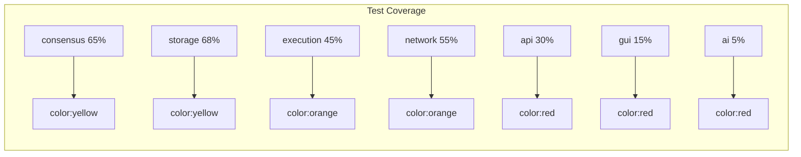

# Lattice V3 Current State Analysis
## Executive Summary Report
**Date:** December 2024  
**Version:** 1.0.0  
**Status:** Development Phase - Pre-Alpha

## 1. Project Overview

Lattice V3 is an AI-native Layer-1 blockchain implementing GhostDAG consensus with EVM compatibility, designed to serve as infrastructure for decentralized AI model deployment and inference.

### Core Value Propositions
- **GhostDAG Consensus**: High-throughput DAG-based consensus with fast finality
- **EVM Compatibility**: Full Ethereum smart contract support
- **AI-Native Features**: On-chain model registry, inference precompiles, ZKP validation
- **Model Context Protocol (MCP)**: Standardized AI model interaction layer

## 2. Implementation Status Matrix

### ✅ Complete (Production-Ready)
| Module | Component | Status | Test Coverage |
|--------|-----------|--------|---------------|
| consensus | GhostDAG core | ✅ Complete | 65% |
| consensus | Blue set calculation | ✅ Complete | 80% |
| consensus | Tip selection | ✅ Complete | 70% |
| storage | RocksDB integration | ✅ Complete | 75% |
| storage | Block store | ✅ Complete | 70% |
| storage | State trie | ✅ Complete | 60% |

### ⚠️ Partially Complete (Needs Work)
| Module | Component | Status | Issues | Priority |
|--------|-----------|--------|--------|----------|
| execution | Transaction processor | 70% | GUI producer not executing | CRITICAL |
| execution | Address derivation | 60% | 20-byte vs 32-byte mismatch | CRITICAL |
| api | JSON-RPC | 75% | Missing EIP-1559 decoder | HIGH |
| api | Nonce management | 50% | Using "latest" not "pending" | HIGH |
| network | P2P messaging | 80% | Missing rate limiting | MEDIUM |
| gui | Block producer | 40% | No execution, only simulation | CRITICAL |

### ❌ Incomplete (TODO/Stub)
| Module | Component | Status | Description | Priority |
|--------|-----------|--------|-------------|----------|
| ai | Model inference | 10% | Stub implementation only | MEDIUM |
| ai | Training coordination | 5% | Placeholder code | LOW |
| ai | IPFS integration | 0% | Not implemented | MEDIUM |
| ai | LoRA adapters | 15% | Basic structure only | LOW |
| security | Formal verification | 0% | Not started | HIGH |
| security | Penetration testing | 0% | Not started | CRITICAL |

## 3. Critical Issues Analysis

### 🔴 P0 - Critical (Blocks Production)

#### Issue #1: Transaction Pipeline Broken
**Location:** `gui/lattice-core/src-tauri/src/block_producer.rs`
```rust
// Current: GUI producer doesn't execute transactions
// Impact: Transactions appear pending forever in GUI
// Fix Required: Align with node/src/producer.rs implementation
```

#### Issue #2: Address Format Mismatch
**Location:** `core/execution/src/executor.rs:338`
```rust
// Current: Incorrect address derivation for transfers
// Impact: Funds sent to wrong addresses
// Fix Required: Standardize 20-byte address handling
```

### 🟡 P1 - High Priority

#### Issue #3: Missing EIP-1559 Support
**Location:** `core/api/src/eth_tx_decoder.rs`
```rust
// Current: Limited transaction type support
// Impact: MetaMask transactions fail
// Fix Required: Implement full EIP-1559 decoder
```

#### Issue #4: Unsafe Static Usage
**Location:** `core/api/src/eth_tx_decoder.rs:12`
```rust
static mut NONCE_COUNTER: u64 = 0; // UNSAFE!
// Impact: Race conditions, memory safety issues
// Fix Required: Use atomic operations
```

### 🟢 P2 - Medium Priority

#### Issue #5: No Rate Limiting
**Location:** `core/network/src/peer_manager.rs`
```rust
// Current: No message rate limiting
// Impact: DoS vulnerability
// Fix Required: Implement rate limiter
```

## 4. Test Coverage Analysis

### Current Coverage by Module



### Missing Test Categories

#### Unit Tests
- [ ] Transaction decoder edge cases
- [ ] Address derivation consistency
- [ ] Signature verification paths
- [ ] Error handling paths
- [ ] Resource limits

#### Integration Tests
- [ ] GUI → Core transaction flow
- [ ] Mempool → Execution pipeline
- [ ] Network → Consensus sync
- [ ] API → Storage queries
- [ ] Contract → Precompile calls

#### Security Tests
- [ ] Fuzzing infrastructure
- [ ] Penetration testing
- [ ] DoS resistance
- [ ] Cryptographic validation
- [ ] Economic attack vectors

#### Performance Tests
- [ ] Transaction throughput
- [ ] Block propagation latency
- [ ] Memory usage under load
- [ ] Disk I/O patterns
- [ ] Network bandwidth usage

## 5. Security Vulnerability Assessment

### Critical Vulnerabilities

| ID | Component | Vulnerability | Risk | Status |
|----|-----------|--------------|------|--------|
| SEC-001 | eth_tx_decoder | Unsafe static mutable | Memory corruption | OPEN |
| SEC-002 | Executor | Address confusion | Fund loss | OPEN |
| SEC-003 | Network | No rate limiting | DoS attacks | OPEN |
| SEC-004 | API | Input validation gaps | Injection | OPEN |
| SEC-005 | Storage | No encryption at rest | Data exposure | OPEN |

### Security Debt

1. **No Formal Security Audit**
   - Required before mainnet
   - Estimated cost: $100-200k
   - Timeline: 4-6 weeks

2. **Missing Security Infrastructure**
   - No intrusion detection
   - No security monitoring
   - No incident response plan
   - No key rotation mechanism

## 6. Performance Baseline

### Current Metrics (Testnet)

| Metric | Current | Target | Gap |
|--------|---------|--------|-----|
| TPS | ~500 | 10,000 | 95% |
| Block Time | 2-3s | 1s | 50% |
| Finality | 15-20s | <12s | 40% |
| Mempool Size | 1,000 | 10,000 | 90% |
| Peer Count | 10-20 | 100+ | 80% |

### Bottlenecks Identified

1. **Sequential Transaction Processing**
   - No parallel execution in GUI
   - Single-threaded mempool validation

2. **Inefficient State Access**
   - No state caching in executor
   - Redundant database queries

3. **Network Overhead**
   - No message batching
   - Redundant gossip messages

## 7. Production Readiness Checklist

### Infrastructure ❌ (20% Complete)
- [ ] Load balancing
- [ ] Auto-scaling
- [ ] Monitoring/alerting
- [ ] Backup/recovery
- [ ] Disaster recovery plan

### Security ❌ (15% Complete)
- [ ] Security audit
- [ ] Penetration testing
- [ ] Key management system
- [ ] Access control
- [ ] Compliance review

### Operations ❌ (25% Complete)
- [ ] Deployment automation
- [ ] Configuration management
- [ ] Log aggregation
- [ ] Metrics collection
- [ ] Incident response

### Documentation ⚠️ (40% Complete)
- [x] Basic architecture docs
- [ ] API documentation
- [ ] Deployment guide
- [ ] Operations manual
- [ ] Security guidelines

## 8. Immediate Action Items

### Week 1-2: Critical Fixes
1. Fix GUI transaction execution
2. Standardize address handling
3. Replace unsafe statics
4. Add basic input validation

### Week 3-4: Testing Infrastructure
1. Set up CI/CD pipeline
2. Add integration test suite
3. Implement fuzzing framework
4. Create benchmark suite

### Week 5-6: Security Hardening
1. Add rate limiting
2. Implement signature validation
3. Add monitoring/alerting
4. Security review

### Week 7-8: Performance Optimization
1. Parallel transaction processing
2. State caching layer
3. Network message batching
4. Database query optimization

## 9. Risk Assessment

### Technical Risks
| Risk | Probability | Impact | Mitigation |
|------|------------|--------|------------|
| Transaction pipeline failure | HIGH | CRITICAL | Immediate fix required |
| Security breach | MEDIUM | CRITICAL | Security audit needed |
| Performance degradation | HIGH | HIGH | Optimization sprint |
| Network instability | MEDIUM | HIGH | Add monitoring |

### Project Risks
- **Timeline Risk**: 3-4 months to production readiness
- **Resource Risk**: Need security audit budget
- **Technical Debt**: Growing rapidly, needs attention
- **Dependency Risk**: Multiple external libraries

## 10. Recommendations

### Immediate Priority
1. **Fix Transaction Pipeline** - Without this, system is unusable
2. **Security Hardening** - Critical vulnerabilities must be addressed
3. **Testing Infrastructure** - Cannot ship without comprehensive tests

### Short-term (1 month)
1. Complete integration testing
2. Performance optimization
3. Documentation completion
4. Security audit preparation

### Medium-term (3 months)
1. AI feature completion
2. Production infrastructure
3. Mainnet preparation
4. Community testing

## Conclusion

Lattice V3 shows strong architectural design and innovative features, but critical gaps in the transaction pipeline, security infrastructure, and test coverage prevent production deployment. The immediate focus must be on fixing the transaction execution path, implementing security measures, and establishing comprehensive testing before proceeding with advanced AI features.

**Current Production Readiness: 35%**
**Estimated Time to Production: 3-4 months**
**Critical Path: Transaction Pipeline → Security → Testing → Performance → Production**