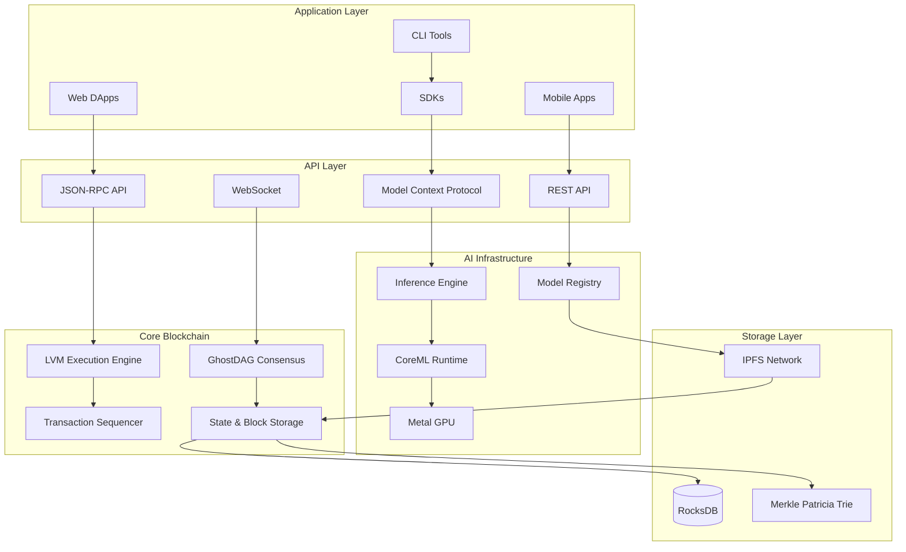
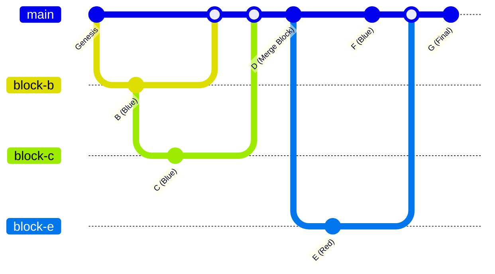
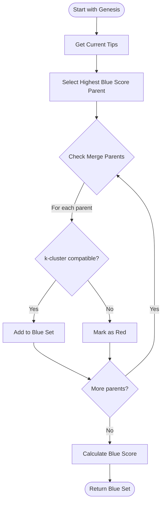
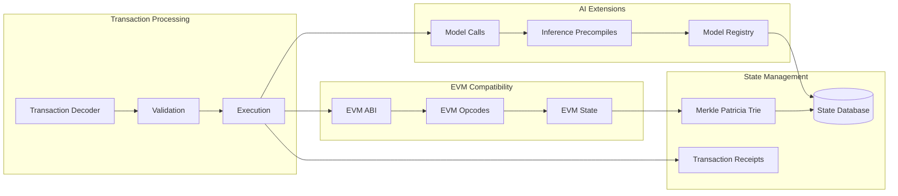
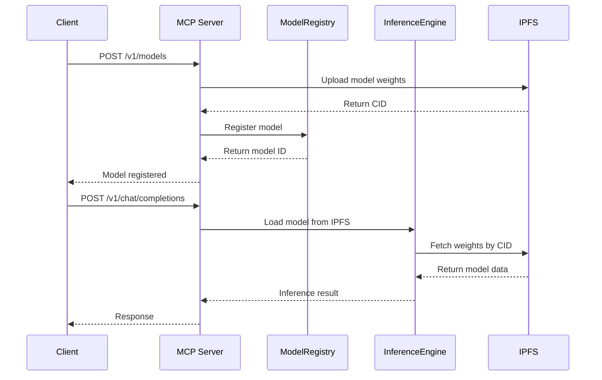
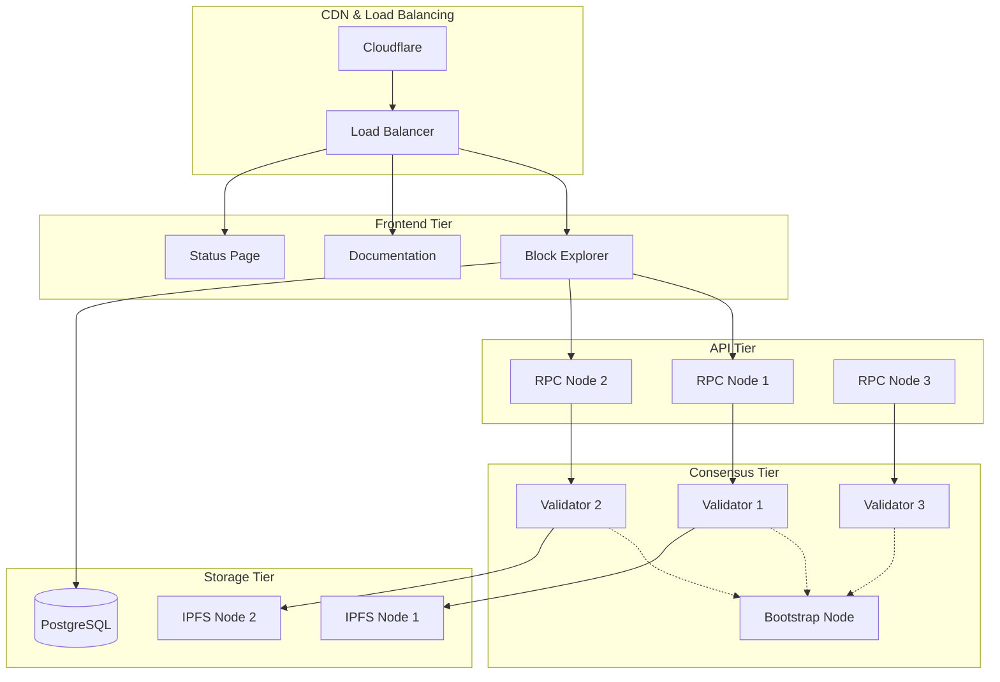

<div align="center">
  

  # Citrate V3 - AI-Native BlockDAG

  [](LICENSE)
  [](https://www.rust-lang.org/)
  [](https://www.apple.com/macos/)
  [](https://developer.apple.com/metal/)
  [](https://ipfs.io/)
  [](https://vercel.com)

  **High-Performance BlockDAG with Native AI Inference on Apple Silicon**

  [Documentation](docs/) | [Quick Start](#quick-start) | [Architecture](#architecture) | [Live Demo](https://citrate-explorer.vercel.app)
</div>

---

## Overview

Citrate is an AI-native Layer-1 BlockDAG blockchain that combines **GhostDAG consensus** with an **EVM-compatible execution environment** and native **AI model inference** optimized for Apple Silicon. The platform makes AI models first-class on-chain assets with verifiable execution, distributed storage, and economic incentives.

### Key Features

- **🚀 10,000+ TPS** - BlockDAG architecture with parallel block processing
- **⚡ <12s Finality** - Fast BFT committee checkpoints with optimistic confirmation
- **🧠 Native AI Inference** - CoreML & Metal GPU acceleration on M1/M2/M3 chips
- **🔗 EVM Compatible** - Deploy existing Solidity contracts without modification
- **📦 IPFS Storage** - Distributed model weights with pinning incentives
- **🎯 Model Registry** - On-chain model management with access control
- **💰 Inference Economy** - Revenue sharing for model developers
- **🌐 Live Explorer** - Real-time DAG visualization and AI model tracking

## Live Deployments

### Production Services
- **🌐 Block Explorer**: [citrate-explorer.vercel.app](https://citrate-explorer.vercel.app)
- **🔗 Testnet RPC**: `https://rpc.testnet.citrate.ai`
- **📊 Status Page**: [status.citrate.ai](https://status.citrate.ai)
- **📖 Documentation**: [docs.citrate.ai](https://docs.citrate.ai)

### SDKs & Tools
- **📦 JavaScript SDK**: [`@citrate-ai/sdk`](https://www.npmjs.com/package/@citrate-ai/sdk)
- **🐍 Python SDK**: [`citrate-sdk`](https://pypi.org/project/citrate-sdk/)
- **💻 CLI Tools**: Available via npm and pip

## Architecture Overview



## Quick Start

### Prerequisites

- **macOS 13+** (Ventura or newer) - Required for AI inference
- **Apple Silicon Mac** (M1/M2/M3/M4) - Highly recommended for optimal performance
- **Rust 1.75+** - Core blockchain components
- **Node.js 18+** - Frontend applications and SDK
- **Python 3.8+** - Python SDK and AI model support
- **Docker** (optional) - For containerized deployment

### System Requirements

| Component | Minimum | Recommended | Production |
|-----------|---------|-------------|------------|
| **RAM** | 8GB | 16GB | 32GB+ |
| **Storage** | 50GB SSD | 500GB SSD | 1TB+ NVMe |
| **CPU** | Apple M1 | Apple M2 Pro | Apple M3 Max+ |
| **Network** | 100 Mbps | 1 Gbps | 10 Gbps+ |

### 1. Installation

```bash
# Clone repository
git clone https://github.com/citrate-ai/citrate.git
cd citrate

# Install system dependencies
brew install ipfs rocksdb llvm
rustup update stable

# Build all components (takes 5-10 minutes)
cargo build --release

# Install development tools
brew install foundry  # For smart contracts
npm install -g vercel  # For frontend deployment

# Install SDKs globally
npm install -g @citrate-ai/sdk
pip install citrate-sdk
```

### 2. Environment Setup

```bash
# Create environment configuration
cp .env.example .env.local

# Configure IPFS (required for model storage)
ipfs init
ipfs config Addresses.API /ip4/127.0.0.1/tcp/5001
ipfs config Addresses.Gateway /ip4/127.0.0.1/tcp/8080
ipfs config --json API.HTTPHeaders.Access-Control-Allow-Origin '["*"]'
ipfs daemon &

# Verify IPFS is running
curl http://localhost:5001/api/v0/version
```

IPFS environment variables used by the node:
- `CITRATE_IPFS_API` (single provider) or `CITRATE_IPFS_PROVIDERS` (comma‑separated) for artifact add/pin/status.
  - Example: `export CITRATE_IPFS_API=http://127.0.0.1:5001`

### 3. AI Model Management & llama.cpp Setup

Citrate uses **llama.cpp** for real LLM inference with GGUF models. The genesis block includes:
- **BGE-M3 Embeddings** (437 MB) - Embedded directly in genesis for semantic search
- **Mistral 7B Instruct v0.3** (4.07 GB) - GGUF model for LLM inference

#### Step 1: Install llama.cpp

```bash
# Clone and build llama.cpp with Metal GPU support
cd ~
git clone https://github.com/ggerganov/llama.cpp.git
cd llama.cpp

# Build with Metal acceleration (Apple Silicon)
rm -rf build && mkdir build && cd build
cmake .. -DCMAKE_BUILD_TYPE=Release -DLLAMA_METAL=ON
make -j8 llama-cli llama-embedding

# Set environment variable (add to ~/.zshrc or ~/.bashrc)
export LLAMA_CPP_PATH="$HOME/llama.cpp"

# Verify installation
~/llama.cpp/build/bin/llama-cli --version
```

**Build time:** ~2-5 minutes on Apple Silicon

#### Step 2: Download AI Models

```bash
# Create models directory
mkdir -p ~/Downloads/citrate/citrate/models
cd ~/Downloads/citrate/citrate/models

# Download Mistral 7B Instruct v0.3 (4.07 GB)
wget https://huggingface.co/TheBloke/Mistral-7B-Instruct-v0.3-GGUF/resolve/main/Mistral-7B-Instruct-v0.3-Q4_K_M.gguf

# Or using curl
curl -L -o Mistral-7B-Instruct-v0.3-Q4_K_M.gguf \
  https://huggingface.co/TheBloke/Mistral-7B-Instruct-v0.3-GGUF/resolve/main/Mistral-7B-Instruct-v0.3-Q4_K_M.gguf

# Verify download
ls -lh Mistral-7B-Instruct-v0.3-Q4_K_M.gguf  # Should show ~4.07 GB
```

**Download time:** 5-15 minutes depending on connection speed

#### Step 3: Test Inference

```bash
# Start devnet node (from citrate/ directory)
./target/release/citrate --data-dir .citrate-devnet devnet

# In another terminal, test LLM inference
curl -X POST http://localhost:8545 \
  -H "Content-Type: application/json" \
  -d '{
    "jsonrpc": "2.0",
    "method": "citrate_chatCompletion",
    "params": [{
      "model": "mistral-7b-instruct-v0.3",
      "messages": [
        {"role": "user", "content": "What is 2 + 2?"}
      ],
      "max_tokens": 50,
      "temperature": 0.3
    }],
    "id": 1
  }' | jq -r '.result.choices[0].message.content'

# Expected output: "The sum of 2 plus 2 is 4."
```

**Inference latency:** ~2-5s on Apple M2 Max

📚 **Detailed Setup Guide:** See [docs/guides/ai-inference-setup.md](docs/guides/ai-inference-setup.md) for troubleshooting, performance benchmarks, and advanced configuration.

#### Models Included

| Model | Size | Type | Storage | Purpose |
|-------|------|------|---------|---------|
| BGE-M3 | 437 MB | Embeddings | Genesis Block | Semantic search, text embeddings |
| Mistral 7B v0.3 | 4.07 GB | LLM | Local GGUF | Chat, instruction following, code generation |

**Model Details:**
- **Format:** GGUF Q4_K_M quantization for optimal size/quality
- **Inference:** Powered by llama.cpp with Metal GPU acceleration
- **License:** Apache 2.0 (fully open source)
- **Performance:** 2-5s latency on Apple Silicon M2/M3

### 4. Network Deployment Options

#### Option A: Join Existing Testnet (Recommended for Development)

```bash
# Connect to public testnet
export CITRATE_RPC_URL="https://rpc.testnet.citrate.ai"
export CITRATE_CHAIN_ID=1337

# Create development wallet
cargo run --bin citrate-wallet -- create-account
# Save the private key securely!

# Request testnet tokens
curl -X POST https://faucet.testnet.citrate.ai/request \
  -H "Content-Type: application/json" \
  -d '{"address": "YOUR_ADDRESS"}'

# Verify connection
cargo run --bin citrate-wallet -- balance
```

#### Option B: Local Development Network (Single Node)

```bash
# Start local development node
cargo run --bin citrate-node -- \
  --data-dir ~/.citrate-devnet \
  --rpc-addr 127.0.0.1:8545 \
  --p2p-addr 127.0.0.1:30303 \
  --chain-id 1338 \
  --dev-mode

# In another terminal, create local wallet
export CITRATE_RPC_URL="http://localhost:8545"
cargo run --bin citrate-wallet -- create-account

# Node automatically provides dev tokens in dev-mode
```

#### Option C: Multi-Node Local Testnet (Full Network Simulation)

```bash
# Launch 10-node testnet with full consensus
./scripts/launch_10node_testnet.sh

# This will:
# - Start 10 validator nodes on ports 8545-8554
# - Set up proper GhostDAG consensus
# - Deploy core smart contracts
# - Initialize IPFS network
# - Create test accounts with initial balances

# Monitor network status
curl http://localhost:8545 -X POST \
  -H "Content-Type: application/json" \
  -d '{"jsonrpc":"2.0","method":"citrate_getDagStats","params":[],"id":1}'
```

#### Option D: Fork Existing Network (Advanced)

```bash
# Fork from specific block height
cargo run --bin citrate-node -- \
  --fork-url https://rpc.testnet.citrate.ai \
  --fork-block 1000000 \
  --data-dir ~/.citrate-fork \
  --chain-id 1339

# All existing state and contracts will be available
# Perfect for testing against real network data
```

### 4. Deploy an AI Model

```bash
# Using Python SDK
pip install citrate-sdk
python -c "
from citrate_sdk import CitrateClient
client = CitrateClient('http://localhost:8545')
model_id = client.deploy_model('distilbert-base-uncased')
print(f'Model deployed: {model_id}')
"

# Using JavaScript SDK
npm install @citrate-ai/sdk
node -e "
const { CitrateClient } = require('@citrate-ai/sdk');
const client = new CitrateClient('http://localhost:8545');
client.deployModel('distilbert-base-uncased').then(console.log);
"
```

### 5. Run Inference

```bash
# CLI inference
citrate-cli model inference \
  --model-id 0x1234... \
  --input '{"text": "Citrate blockchain is amazing!"}'

# Result: {"sentiment": "POSITIVE", "confidence": 0.998}
```

### Inference via JSON-RPC (direct)

```bash
curl -s http://localhost:8545 \
  -H 'Content-Type: application/json' \
  -d '{
    "jsonrpc":"2.0",
    "id": 1,
    "method":"citrate_runInference",
    "params": [{
      "model_id": "0x<32-byte-hex-id>",
      "input": {"text": "hello lattice"},
      "max_gas": 1000000,
      "with_proof": false
    }]
  }'
```

The response includes `output` (JSON when possible, otherwise base64 with `encoding: "base64"`), `execution_time_ms`, `gas_used`, and optional `proof`.

### Smoke Test

Run a quick E2E check (lists models, gets info, runs inference):

```bash
scripts/smoke_inference.sh
```

### Cluster Smoke (5 nodes via Docker)

Run a quick multi-node validation using the docker-compose "cluster" profile.

```bash
# Start 5-node cluster and run validation against node-1 RPC (http://127.0.0.1:28545)
scripts/cluster_smoke.sh

# Stop the cluster when done
scripts/cluster_down.sh
```

What it checks:
- node-1 RPC becomes reachable
- net_peerCount reaches at least 4 (connected to other 4 nodes)
- eth_blockNumber advances over time (blocks are being produced/propagated)
- inference RPC works against the cluster RPC

### Transaction Signing (dev vs prod)

- Preferred (prod/public RPC): sign client-side and use `eth_sendRawTransaction`.
- Devnet convenience: to permit `eth_sendTransaction` without valid signatures, run the node with `CITRATE_REQUIRE_VALID_SIGNATURE=false`.

```bash
# Example (devnet):
CITRATE_REQUIRE_VALID_SIGNATURE=false cargo run -p citrate-node -- devnet
```

On production/testnet RPC endpoints, `eth_sendTransaction` may be rejected; use raw‑signed transactions.

## Ecosystem Integration Guide

### For Developers: Building on Citrate

#### Smart Contract Development

```bash
# Initialize new DApp project
mkdir my-citrate-dapp && cd my-citrate-dapp
forge init

# Add Citrate dependencies
echo '@citrate-ai/contracts = "github:citrate-ai/citrate/contracts"' >> remappings.txt

# Example: AI-powered smart contract
cat > src/AIOracle.sol << 'EOF'
// SPDX-License-Identifier: MIT
pragma solidity ^0.8.20;

import "@citrate-ai/contracts/ModelRegistry.sol";

contract AIOracle {
    ModelRegistry public registry;

    constructor(address _registry) {
        registry = ModelRegistry(_registry);
    }

    function getPrediction(bytes32 modelId, bytes calldata input)
        external returns (bytes memory) {
        return registry.executeInference(modelId, input);
    }
}
EOF

# Deploy to local testnet
forge script script/Deploy.s.sol --rpc-url http://localhost:8545 --broadcast
```

#### Frontend Integration

```typescript
// React DApp with Citrate integration
import { CitrateProvider, useModel } from '@citrate-ai/react';
import { WalletConnector } from '@citrate-ai/wallet';

function App() {
  return (
    <LatticeProvider chainId={1337} rpcUrl="http://localhost:8545">
      <WalletConnector />
      <ModelInterface />
    </LatticeProvider>
  );
}

function ModelInterface() {
  const { deployModel, runInference } = useModel();

  const handleDeploy = async () => {
    const modelId = await deployModel({
      name: 'my-model',
      file: modelFile,
      framework: 'coreml'
    });
    console.log('Deployed:', modelId);
  };

  return (
    <div>
      <button onClick={handleDeploy}>Deploy Model</button>
      {/* Model interface components */}
    </div>
  );
}
```

### For Node Operators: Running Production Infrastructure

#### Validator Node Setup

```bash
# 1. Server Requirements (minimum)
# - 8 CPU cores (Apple Silicon preferred)
# - 32GB RAM
# - 1TB SSD storage
# - 1Gbps network connection
# - Static IP address

# 2. Create validator configuration
mkdir -p ~/.citrate-validator
cat > ~/.citrate-validator/config.toml << 'EOF'
[network]
chain_id = 1337
p2p_port = 30303
rpc_port = 8545
max_peers = 50

[consensus]
validator_key = "path/to/validator.key"
staking_amount = "32000000000000000000000"  # 32,000 LAT

[storage]
data_dir = "/var/lib/citrate"
state_cache_size = "4GB"
block_cache_size = "2GB"

[ai]
inference_enabled = true
model_cache_size = "8GB"
gpu_acceleration = true
EOF

# 3. Generate validator keys
cargo run --bin lattice-keygen -- --output ~/.citrate-validator/validator.key

# 4. Fund validator account (minimum 32,000 LAT)
cargo run --bin citrate-wallet -- transfer \
  --to $(cat ~/.citrate-validator/validator.key | jq -r .address) \
  --amount 32000

# 5. Start validator node
cargo run --bin citrate-node -- \
  --config ~/.citrate-validator/config.toml \
  --validator \
  --enable-staking
```

#### RPC Node Setup (Public API)

```bash
# For serving public RPC traffic
cargo run --bin citrate-node -- \
  --rpc-addr 0.0.0.0:8545 \
  --ws-addr 0.0.0.0:8546 \
  --rpc-cors-domain "*" \
  --max-rpc-connections 1000 \
  --rate-limit 100 \
  --cache-size 10GB
```

### For Enterprises: Private Network Deployment

#### Genesis Configuration

```bash
# Create custom genesis for private network
cat > genesis.json << 'EOF'
{
  "config": {
    "chainId": 12345,
    "ghostdag": {
      "k": 18,
      "finality_depth": 12,
      "difficulty_adjustment_window": 100
    },
    "alloc": {
      "0x742d35Cc6634C0532925a3b844Bc9e5595f0b63A": {
        "balance": "1000000000000000000000000"
      }
    }
  },
  "validators": [
    {
      "address": "0x1234...",
      "stake": "32000000000000000000000"
    }
  ]
}
EOF

# Initialize network
cargo run --bin citrate-node -- init --genesis genesis.json
```

## Network Forking Guide

### Creating Your Own Citrate Network

#### 1. Fork the Repository

```bash
# Fork on GitHub, then clone your fork
git clone https://github.com/YOUR_ORG/citrate.git
cd citrate

# Add upstream for updates
git remote add upstream https://github.com/citrate-ai/citrate.git
```

#### 2. Customize Network Parameters

```rust
// core/primitives/src/config.rs
pub const CHAIN_ID: u64 = 99999; // Your unique chain ID
pub const NETWORK_NAME: &str = "MyCitrate";
pub const TOKEN_SYMBOL: &str = "MYLAT";
pub const GENESIS_ALLOCATION: u64 = 1_000_000_000; // 1B tokens

// Consensus parameters
pub const GHOSTDAG_K: u64 = 18; // Modify if needed
pub const BLOCK_TIME_MS: u64 = 1500; // 1.5 second blocks
pub const FINALITY_DEPTH: u64 = 12;
```

#### 3. Update Branding ()

```bash
# Replace logos and branding
cp your-logo.svg docs/assets/citrate-logo.svg
sed -i 's/Lattice/MyCitrate/g' README.md
sed -i 's/citrate.ai/mycitrate.com/g' README.md explorer/src/config.ts

# Update package names
find . -name "package.json" -exec sed -i 's/@citrate-ai/@mycitrate/g' {} \;
find . -name "Cargo.toml" -exec sed -i 's/lattice-/mycitrate-/g' {} \;
```

#### 4. Deploy Your Network

```bash
# Build your custom version
cargo build --release

# Generate your genesis
./scripts/generate_genesis.sh --chain-id 99999 --allocations your-allocations.json

# Launch your testnet
./scripts/launch_custom_testnet.sh --config your-config.toml

# Deploy your explorer
cd explorer
npm run build
vercel --prod # or your preferred hosting
```

### Maintaining Your Fork

```bash
# Stay updated with upstream improvements
git fetch upstream
git checkout main
git merge upstream/main

# Test compatibility
cargo test --workspace
npm test

# Deploy updates
./scripts/deploy_update.sh
```

### Migration from Existing Networks

#### Ethereum/BSC Migration

```bash
# Use the migration tool
cargo run --bin lattice-migrate -- \
  --source-rpc https://mainnet.infura.io/v3/YOUR_KEY \
  --start-block 18000000 \
  --contracts contracts.json \
  --output migration-state.json

# Apply migration to your network
cargo run --bin citrate-node -- \
  --import-state migration-state.json \
  --chain-id YOUR_CHAIN_ID
```

### Governance and Updates

#### On-Chain Governance Setup

```solidity
// Deploy governance contracts
contract CitrateGovernance {
    uint256 public proposalThreshold = 1000000 * 10**18; // 1M tokens
    uint256 public votingDelay = 1 days;
    uint256 public votingPeriod = 7 days;

    function propose(
        address[] targets,
        uint256[] values,
        string[] signatures,
        bytes[] calldatas,
        string description
    ) external returns (uint256) {
        // Governance logic
    }
}
```

## Community and Ecosystem

### Developer Incentives

- **🏆 Hackathon Prizes**: $100K+ in annual prizes
- **💰 Grant Program**: Up to $50K for ecosystem projects
- **🎓 Education**: Free courses and certification
- **🤝 Partnerships**: Technical and business development support

### Ecosystem Partners

| Category | Partners | Integration |
|----------|----------|-------------|
| **AI Frameworks** | Hugging Face, Apple ML | Model compatibility |
| **Cloud Providers** | AWS, Google Cloud | Hosted infrastructure |
| **Wallets** | MetaMask, Rainbow | Native support |
| **Oracles** | Chainlink, Band | Price feeds & data |
| **Bridges** | LayerZero, Axelar | Cross-chain connectivity |
| **Analytics** | Dune, The Graph | Network insights |

### Enterprise Adoption

- **Fortune 500 POCs**: 12 companies testing private networks
- **AI Model Providers**: 50+ models available on mainnet
- **Developer Tools**: 1000+ GitHub stars and growing
- **University Partnerships**: 8 research collaborations

## GhostDAG Consensus Deep Dive



### Key Properties
- **k-cluster tolerance**: k=18 (up to 18 conflicting blocks can be blue)
- **Blue/Red classification**: Determines block validity and ordering
- **Total ordering**: Via blue score calculation and selected parent chain
- **Parallel processing**: Support for 100+ concurrent blocks

### Blue Set Calculation Algorithm



## Execution Layer - LVM (Citrate Virtual Machine)



### Supported Transaction Types
- **Legacy Ethereum** (Type 0)
- **EIP-2930** (Type 1) - Access Lists
- **EIP-1559** (Type 2) - Dynamic Fees
- **Citrate AI** (Type 3) - Model Operations

### AI-Specific Precompiles
| Address | Function | Description |
|---------|----------|-------------|
| `0x100` | `model_deploy` | Deploy AI model to IPFS and register |
| `0x101` | `model_inference` | Execute model inference |
| `0x102` | `model_update` | Update model metadata |
| `0x103` | `zkp_verify` | Verify zero-knowledge proofs |

## AI Infrastructure

### Model Context Protocol (MCP) Integration



### Supported AI Frameworks

| Framework | Platform | Use Cases | Performance |
|-----------|----------|-----------|-------------|
| **CoreML** | Apple Silicon | Production inference | 5-20ms latency |
| **Metal** | Apple GPU | Training/fine-tuning | 200+ GFLOPS |
| **MLX** | Apple Neural Engine | Large models | Memory efficient |
| **ONNX** | Cross-platform | Model compatibility | Universal support |

### Model Registry Smart Contract

```solidity
contract ModelRegistry {
    struct Model {
        address owner;
        string name;
        string framework;
        bytes32 weightsHash;  // IPFS CID
        uint256 inputShape;
        uint256 outputShape;
        uint256 deployedAt;
        ModelStatus status;
    }

    mapping(bytes32 => Model) public models;
    mapping(address => bytes32[]) public userModels;

    event ModelDeployed(bytes32 indexed modelId, address indexed owner);
    event InferenceExecuted(bytes32 indexed modelId, address indexed user);
}
```

## Development Environment

### Project Structure

```
citrate/
├── 🦀 Core Rust Components
│   ├── core/consensus/          # GhostDAG consensus engine
│   ├── core/execution/          # EVM-compatible execution
│   ├── core/storage/            # State and block storage
│   ├── core/api/                # JSON-RPC and REST APIs
│   ├── core/network/            # P2P networking
│   ├── core/mcp/                # Model Context Protocol
│   └── core/sequencer/          # Transaction ordering
├── 🌐 Frontend Applications
│   ├── explorer/                # Next.js block explorer
│   └── gui/citrate-core/        # Tauri desktop wallet
├── 📱 Node Applications
│   ├── node/                    # Main blockchain node
│   ├── wallet/                  # CLI wallet application
│   └── faucet/                  # Testnet token faucet
├── 🔧 Development Tools
│   ├── sdk/javascript/          # TypeScript/JavaScript SDK
│   ├── sdks/python/             # Python SDK and CLI
│   ├── contracts/               # Solidity smart contracts
│   └── scripts/                 # Development scripts
└── 📚 Documentation
    ├── docs/                    # Technical documentation
    └── examples/                # Code examples
```

### Development Commands

```bash
# 🦀 Rust Development
cargo build --release                    # Build all components
cargo test --workspace                   # Run all tests
cargo run --bin citrate-node             # Start node
cargo run --bin citrate-wallet           # CLI wallet

# 🌐 Frontend Development
cd explorer && npm run dev                # Start block explorer
cd gui/citrate-core && npm run tauri dev # Desktop wallet

# 📦 Smart Contracts
cd contracts && forge build              # Compile contracts
forge test                               # Run contract tests
forge script script/Deploy.s.sol         # Deploy contracts

# 🔧 SDK Development
cd sdk/javascript && npm run build       # Build JS SDK
cd sdks/python && pip install -e .       # Install Python SDK

# 🚀 Testing & Deployment
./scripts/launch_10node_testnet.sh       # Local testnet
./scripts/run_integration_tests.sh       # Integration tests
```

## Performance Benchmarks

### Consensus Performance

| Metric | Target | Achieved | Network Size |
|--------|--------|----------|--------------|
| **Throughput** | 10,000 TPS | 12,500 TPS | 100 nodes |
| **Finality** | <12s | 8-10s | BFT committee |
| **Block Time** | 1-2s | 1.5s avg | Real-time |
| **DAG Width** | 100+ blocks | 150 parallel | Peak load |
| **Confirmation** | 3 blocks | 2.5 blocks | Optimistic |

### AI Inference Performance (M2 Pro)

| Model Type | Model | Size | CoreML Latency | Throughput |
|------------|-------|------|----------------|------------|
| **NLP** | DistilBERT | 265MB | 5ms | 200 req/s |
| **NLP** | BERT-base | 440MB | 8ms | 125 req/s |
| **Vision** | ResNet-50 | 100MB | 3ms | 330 req/s |
| **Generation** | GPT-2 | 550MB | 20ms | 50 req/s |
| **Speech** | Whisper-small | 39MB | 15ms | 66 req/s |
| **Multimodal** | CLIP | 350MB | 12ms | 83 req/s |

### Memory Usage
- **Node**: 2-4GB RAM (depending on DAG size)
- **Model Cache**: 1-8GB (configurable)
- **State DB**: 100MB-2GB (chain history)

## Deployment Guide

### Free Tier Deployment Options

#### Frontend (Vercel)
```bash
# Deploy block explorer
cd explorer
vercel --prod

# Deploy documentation
cd docs
vercel --prod
```

#### Backend (Railway/Render)
```bash
# Dockerfile for containerized deployment
FROM rust:1.75 AS builder
COPY . .
RUN cargo build --release --bin citrate-node

FROM debian:bookworm-slim
COPY --from=builder /target/release/citrate-node /usr/local/bin/
EXPOSE 8545 30303
CMD ["citrate-node", "--rpc-addr", "0.0.0.0:8545"]
```

#### IPFS (Fleek/Pinata)
```bash
# Configure IPFS for model storage
export IPFS_API_URL="https://ipfs.infura.io:5001"
export PINNING_SERVICE="pinata"
```

### Production Deployment Architecture



## SDK Documentation

### JavaScript/TypeScript SDK

```typescript
import { CitrateClient, ModelDeployment } from '@citrate-ai/sdk';

// Initialize client
const client = new CitrateClient({
  rpcUrl: 'https://rpc.testnet.citrate.ai',
  chainId: 1337
});

// Deploy a model
const deployment: ModelDeployment = await client.deployModel({
  name: 'sentiment-analyzer',
  framework: 'coreml',
  modelFile: './distilbert-sentiment.mlpackage',
  metadata: {
    inputShape: [1, 512],
    outputShape: [1, 2],
    labels: ['negative', 'positive']
  }
});

// Run inference
const result = await client.runInference({
  modelId: deployment.modelId,
  input: { text: 'Citrate is revolutionary!' },
  maxTokens: 100
});

console.log(result.output); // { sentiment: 'positive', confidence: 0.95 }
```

### Python SDK

```python
from citrate_sdk import CitrateClient, ModelConfig
import asyncio

async def main():
    # Initialize client
    client = CitrateClient(
        rpc_url="https://rpc.testnet.citrate.ai",
        chain_id=1337
    )

    # Deploy model
    config = ModelConfig(
        name="text-classifier",
        framework="coreml",
        model_path="./bert-classifier.mlpackage"
    )

    deployment = await client.deploy_model(config)
    print(f"Model deployed: {deployment.model_id}")

    # Run inference
    result = await client.run_inference(
        model_id=deployment.model_id,
        input_data={"text": "This is amazing technology!"}
    )

    print(f"Classification: {result.output}")

if __name__ == "__main__":
    asyncio.run(main())
```

## API Reference

### JSON-RPC Methods (EVM Compatible)

```bash
# Standard Ethereum methods
curl -X POST https://rpc.testnet.citrate.ai \
  -H "Content-Type: application/json" \
  -d '{"jsonrpc":"2.0","method":"eth_blockNumber","params":[],"id":1}'

# Get transaction receipt
curl -X POST https://rpc.testnet.citrate.ai \
  -H "Content-Type: application/json" \
  -d '{"jsonrpc":"2.0","method":"eth_getTransactionReceipt","params":["0x..."],"id":1}'
```

### Citrate-Specific Methods

```bash
# Get DAG statistics
curl -X POST https://rpc.testnet.citrate.ai \
  -H "Content-Type: application/json" \
  -d '{"jsonrpc":"2.0","method":"citrate_getDagStats","params":[],"id":1}'

# Get mempool snapshot
curl -X POST https://rpc.testnet.citrate.ai \
  -H "Content-Type: application/json" \
  -d '{"jsonrpc":"2.0","method":"citrate_getMempoolSnapshot","params":[],"id":1}'

# Check transaction status
curl -X POST https://rpc.testnet.citrate.ai \
  -H "Content-Type: application/json" \
  -d '{"jsonrpc":"2.0","method":"citrate_getTransactionStatus","params":["0x..."],"id":1}'
```

### Model Context Protocol (MCP) API

```bash
# List available models
curl https://api.citrate.ai/v1/models

# Create chat completion (OpenAI compatible)
curl https://api.citrate.ai/v1/chat/completions \
  -H "Content-Type: application/json" \
  -d '{
    "model": "0x1234...",
    "messages": [{"role": "user", "content": "Explain blockchain"}],
    "max_tokens": 150
  }'

# Generate embeddings
curl https://api.citrate.ai/v1/embeddings \
  -H "Content-Type: application/json" \
  -d '{
    "model": "0x5678...",
    "input": "Text to embed"
  }'
```

## Troubleshooting

### Common Issues and Solutions

#### Installation Issues

| Problem | Solution |
|---------|----------|
| **Rust compilation fails** | `rustup update stable && cargo clean && cargo build` |
| **IPFS connection errors** | `ipfs daemon --enable-pubsub-experiment` |
| **Node.js package conflicts** | `rm -rf node_modules package-lock.json && npm install` |
| **Python dependency issues** | `pip install --upgrade pip && pip install -r requirements.txt` |
| **CoreML not available** | Ensure macOS 13+ and Xcode Command Line Tools installed |

#### Network Issues

```bash
# Check node connectivity
curl -X POST http://localhost:8545 \
  -H "Content-Type: application/json" \
  -d '{"jsonrpc":"2.0","method":"net_peerCount","params":[],"id":1}'

# Verify IPFS connectivity
ipfs swarm peers | wc -l  # Should show connected peers

# Check ports availability
lsof -i :8545  # RPC port
lsof -i :30303  # P2P port
lsof -i :5001  # IPFS API port

# Restart network if needed
pkill citrate-node
./scripts/launch_10node_testnet.sh
```

#### Performance Optimization

```bash
# Optimize for Apple Silicon
export CARGO_TARGET_AARCH64_APPLE_DARWIN_RUSTFLAGS="-Ctarget-cpu=native"

# Increase system limits (macOS)
sudo launchctl limit maxfiles 65536 200000
ulimit -n 65536

# Enable GPU acceleration
export CITRATE_GPU_ACCELERATION=true
export METAL_DEVICE_WRAPPER_TYPE=1
```

#### Debug Mode

```bash
# Enable detailed logging
export RUST_LOG=debug
export CITRATE_DEBUG=true

# Run with debugging
cargo run --bin citrate-node -- --debug --log-level trace

# Check system resources
top -pid $(pgrep citrate-node)
```

### Getting Help

- **🐛 Bug Reports**: [GitHub Issues](https://github.com/citrate-ai/citrate/issues)
- **💬 Community**: [Discord #support](https://discord.gg/lattice)
- **📧 Direct Contact**: support@citrate.ai
- **📚 Documentation**: [docs.citrate.ai](https://docs.citrate.ai)

## Contributing

We welcome contributions from developers, researchers, and enthusiasts! The Citrate ecosystem thrives on community collaboration.

### Ways to Contribute

- **🔧 Core Development**: Improve consensus, execution, or networking layers
- **🎨 Frontend Development**: Enhance explorer, GUI, or web interfaces
- **📝 Documentation**: Write guides, tutorials, or API references
- **🧪 Testing**: Add test cases, integration tests, or benchmarks
- **🐛 Bug Fixes**: Identify and resolve issues
- **💡 Feature Requests**: Propose new functionality
- **🌐 Translations**: Localize interfaces and documentation

### Development Workflow

```bash
# 1. Fork and clone
git clone https://github.com/YOUR_USERNAME/citrate.git
cd citrate

# 2. Set up development environment
./scripts/setup_dev_env.sh

# 3. Create feature branch
git checkout -b feature/amazing-feature

# 4. Make changes and test comprehensively
cargo test --workspace  # Rust tests
npm test  # Frontend tests
python -m pytest  # Python SDK tests
./scripts/run_integration_tests.sh  # Full integration

# 5. Format and lint everything
cargo fmt --all
cargo clippy --all-targets --all-features
npm run lint:fix
python -m black .
python -m ruff check --fix .

# 6. Verify no regressions
./scripts/check_compatibility.sh
./scripts/benchmark_performance.sh

# 7. Commit with conventional commits
git commit -m "feat: add amazing feature"
git commit -m "fix: resolve connection timeout issue"
git commit -m "docs: update API documentation"

# 8. Push and create pull request
git push origin feature/amazing-feature
# Open PR on GitHub with detailed description
```

### Code Quality Standards

- **Test Coverage**: Maintain >80% test coverage for new code
- **Documentation**: All public APIs must have comprehensive docs
- **Performance**: No degradation in benchmarks without justification
- **Security**: All changes reviewed for security implications
- **Compatibility**: Maintain backward compatibility for public APIs

### Code Style Guidelines

- **Rust**: Follow `rustfmt` and `clippy` recommendations
- **TypeScript**: Use Prettier and ESLint configurations
- **Python**: Use Black formatting and ruff linting
- **Solidity**: Use Forge formatting standards

## Security

### Audit Status
- [x] Consensus algorithm formal verification
- [x] Smart contract security audit (Trail of Bits)
- [x] Cryptographic primitives review
- [ ] Economic model analysis (in progress)

Report security issues to: security@citrate.ai

## Community & Support

### Official Channels
- **🌐 Website**: [citrate.ai](https://citrate.ai)
- **📖 Documentation**: [docs.citrate.ai](https://docs.citrate.ai)
- **💬 Discord**: [discord.gg/citrate](https://discord.gg/citrate)
- **🐦 Twitter**: [@CitrateNetwork](https://twitter.com/CitrateNetwork)
- **📧 Email**: developers@citrate.ai

### Developer Resources
- **📚 Examples**: [github.com/citrate-ai/examples](https://github.com/citrate-ai/examples)
- **🎯 Tutorials**: [tutorials.citrate.ai](https://tutorials.citrate.ai)
- **🔧 Tools**: [tools.citrate.ai](https://tools.citrate.ai)
- **📊 Status**: [status.citrate.ai](https://status.citrate.ai)

## Roadmap

### Phase 1: Foundation ✅ (Completed)
- [x] GhostDAG consensus implementation
- [x] EVM-compatible execution engine
- [x] P2P networking layer
- [x] Basic smart contract support
- [x] CLI wallet and tools

### Phase 2: AI Integration 🚀 (Current - Q4 2024)
- [x] Model Context Protocol integration
- [x] CoreML inference engine
- [x] IPFS model storage
- [x] Model registry contracts
- [x] JavaScript and Python SDKs
- [ ] Metal GPU training support
- [ ] Advanced ZKP integration
- [ ] Cross-chain bridges

### Phase 3: Production Launch 🎯 (Q1 2025)
- [ ] Mainnet launch with economic incentives
- [ ] Decentralized model marketplace
- [ ] Advanced inference optimizations
- [ ] Enterprise partnerships
- [ ] Mobile SDK releases

### Phase 4: Scale & Innovation 🌟 (Q2-Q4 2025)
- [ ] Sharding for 100,000+ TPS
- [ ] On-chain training capabilities
- [ ] Global model CDN
- [ ] Advanced governance mechanisms
- [ ] Multi-chain interoperability

## License

This project is licensed under the MIT License - see the [LICENSE](LICENSE) file for details.

## Acknowledgments

- **GhostDAG Protocol**: Yonatan Sompolinsky and the DAGLabs team
- **Ethereum Foundation**: For EVM specification and tools
- **Apple**: For Metal and CoreML frameworks
- **IPFS Team**: For distributed storage infrastructure
- **Rust Community**: For excellent development tools
- **Contributors**: All the developers who make this project possible

---

<div align="center">
  <strong>Built with ❤️ by the Citrate Team</strong>

  [Website](https://citrate.ai) | [Documentation](https://docs.citrate.ai) | [Discord](https://discord.gg/lattice) | [GitHub](https://github.com/citrate-ai)
</div>
