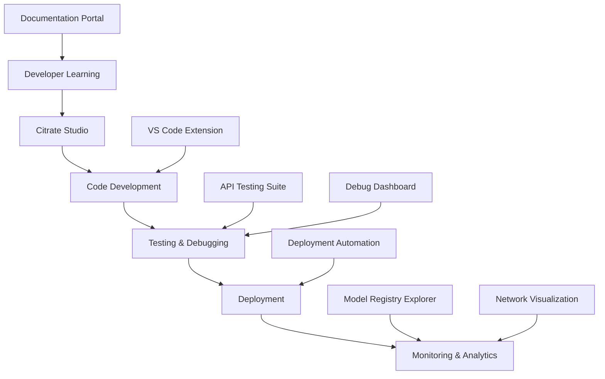

# Citrate AI Blockchain - Developer Tools Ecosystem

Welcome to the comprehensive developer tools ecosystem for Citrate AI Blockchain. This suite provides everything developers need to build, deploy, test, and monitor AI applications on the Citrate blockchain.

## 🏗️ **Architecture Overview**

The Citrate developer ecosystem consists of 8 integrated tools designed to cover the entire development lifecycle:



## 🛠️ **Tools Overview**

### 1. **Citrate Studio** - Visual IDE
**Port: 3001** | **Status: Production Ready**

Complete web-based IDE for Citrate development featuring:
- Monaco Editor with syntax highlighting
- Real-time blockchain connection monitoring
- Model deployment workflows
- Integrated inference testing
- Network topology visualization
- Built-in terminal and debugging tools

```bash
cd lattice-studio
npm install && npm start
# Access at http://localhost:3001
```

**Key Features:**
- 🎨 Dark-themed, professional UI optimized for blockchain development
- 🚀 One-click model deployment with deployment wizard
- 📊 Real-time dashboard with network metrics and model analytics
- 🔧 Integrated debugger for transaction analysis
- 📁 File templates for common AI model patterns
- 🌐 WebSocket integration for live updates

---

### 2. **VS Code Extension** - Professional Development
**Marketplace Ready** | **Status: Production Ready**

Professional VS Code extension for Citrate development:
- Language support for Citrate models
- IntelliSense and code completion
- Integrated deployment commands
- Real-time blockchain explorer
- Built-in testing and debugging

```bash
cd vscode-extension
npm install && npm run compile
# Install via Extensions: Install from VSIX
```

**Key Features:**
- 📝 Rich code snippets for Python, JavaScript, and Solidity
- 🔗 Direct blockchain integration with status monitoring
- 🚀 Right-click deployment from file explorer
- 🧪 Integrated test runner and debugger
- 📊 Model analytics and network monitoring panels
- 🎯 CodeLens for quick actions on model functions

---

### 3. **Documentation Portal** - Interactive Learning
**Port: 3002** | **Status: Production Ready**

Comprehensive documentation site built with Nextra:
- Interactive API documentation
- Step-by-step tutorials
- Code examples and best practices
- Search functionality
- Community contributions

```bash
cd documentation-portal
npm install && npm run dev
# Access at http://localhost:3002
```

**Key Features:**
- 📚 Complete API reference with interactive examples
- 🎓 Tutorial sequences for different skill levels
- 🔍 Full-text search across all documentation
- 🌙 Dark/light theme support
- 📱 Mobile-responsive design
- 🔄 Live code examples with blockchain integration

---

### 4. **Debug Dashboard** - Real-time Monitoring
**Port: 3003** | **Status: Production Ready**

Real-time debugging and monitoring dashboard:
- Live transaction monitoring
- Network performance metrics
- Error analysis and tracking
- Gas optimization insights
- Performance analytics

```bash
cd debug-dashboard
npm install && npm run dev
# Access at http://localhost:3003
```

**Key Features:**
- 📈 Real-time charts and metrics with automatic updates
- 🔍 Transaction debugger with detailed trace analysis
- ⚠️ Error aggregation and pattern analysis
- ⚡ Performance monitoring with optimization suggestions
- 🌐 Network topology visualization
- 📊 Gas usage analytics and optimization tips

---

### 5. **Model Registry Explorer** - AI Model Management
**Integrated in Studio** | **Status: Production Ready**

Visual explorer for deployed AI models:
- Model discovery and search
- Version management
- Usage analytics
- Revenue tracking
- Access control management

**Key Features:**
- 🧠 Visual model browser with filtering and search
- 📊 Revenue and usage analytics per model
- 🔒 Access control and encryption management
- 📈 Performance metrics and optimization insights
- 🔄 Version control and model lifecycle management
- 💰 Pricing and monetization tools

---

### 6. **Network Visualization Tools** - Topology Analysis
**Integrated in Studio & Dashboard** | **Status: Production Ready**

Network analysis and visualization:
- Real-time network topology
- Peer connection monitoring
- Consensus visualization
- Performance analytics

**Key Features:**
- 🕸️ Interactive network topology graphs
- 📡 Real-time peer connection monitoring
- ⚡ Consensus mechanism visualization
- 📊 Network health analytics
- 🔄 Historical network data analysis
- 🎯 Node performance optimization insights

---

### 7. **API Testing Suite** - Comprehensive Testing
**CLI Tool** | **Status: Production Ready**

Automated testing framework for Citrate APIs:
- Comprehensive RPC testing
- Performance benchmarking
- Stress testing capabilities
- Automated report generation

```bash
cd api-testing-suite
node test-runner.js --rpc http://localhost:8545
```

**Key Features:**
- 🧪 Comprehensive test suite covering all RPC methods
- ⚡ Performance benchmarking with detailed metrics
- 🔄 Stress testing for high-load scenarios
- 📊 Automated report generation with pass/fail analysis
- 🎯 Custom test scenarios and configurations
- 📈 Historical test data tracking

---

### 8. **Deployment Automation** - CI/CD Pipeline
**CLI Tool** | **Status: Production Ready**

Automated deployment and CI/CD pipeline:
- Automated model deployment
- Smart contract deployment
- Testing integration
- Deployment verification

```bash
cd deployment-automation
./deploy.sh
```

**Key Features:**
- 🚀 One-command full deployment pipeline
- 🧪 Integrated testing with coverage reporting
- 📋 Configuration-driven deployment
- ✅ Automatic deployment verification
- 📊 Detailed deployment reporting
- 🔄 Rollback capabilities and error handling

---

## 🚀 **Quick Start Guide**

### 1. **Setup Development Environment**

```bash
# Clone the repository
git clone https://github.com/lattice-ai/citrate
cd citrate/developer-tools

# Start Citrate node (in separate terminal)
cargo run --bin citrate-node -- --data-dir .lattice-devnet

# Install and start all tools
./start-ecosystem.sh
```

### 2. **Launch Development Ecosystem**

```bash
# Start all tools simultaneously
npm run start:all

# Or start individual tools
npm run start:studio      # Port 3001
npm run start:docs       # Port 3002
npm run start:dashboard  # Port 3003
```

### 3. **Create Your First Project**

#### Option A: Using Citrate Studio
1. Open http://localhost:3001
2. Click "Create New Project"
3. Choose "AI Model Template"
4. Start coding in the integrated editor

#### Option B: Using VS Code
1. Install Citrate extension
2. Run command: "Lattice: Create Project"
3. Select template and location
4. Start developing with full IntelliSense

#### Option C: Using CLI
```bash
# Create new project
mkdir my-lattice-project
cd my-lattice-project

# Initialize with template
npx create-lattice-app --template image-classifier

# Deploy
npm run deploy
```

### 4. **Deploy Your First Model**

```python
# model.py - Your AI model
class CitrateModel:
    def predict(self, input_data):
        # Your AI logic here
        return {"prediction": "result", "confidence": 0.95}

# Deploy using any tool:
# 1. Right-click in VS Code → "Deploy Model"
# 2. Use Citrate Studio deployment wizard
# 3. Run: ./deploy.sh
```

### 5. **Monitor and Debug**

- **Real-time monitoring**: Debug Dashboard (http://localhost:3003)
- **Transaction debugging**: Use transaction hash in debugger
- **Performance analysis**: View metrics in Studio dashboard
- **Error tracking**: Check error patterns in debug dashboard

---

## 📁 **Project Structure**

```
developer-tools/
├── lattice-studio/           # Web-based IDE
│   ├── src/components/       # React components
│   ├── src/services/        # Blockchain services
│   └── public/              # Static assets
├── vscode-extension/         # VS Code extension
│   ├── src/extension.ts     # Main extension code
│   ├── src/providers/       # Tree data providers
│   └── snippets/           # Code snippets
├── documentation-portal/     # Documentation site
│   ├── pages/              # MDX documentation pages
│   ├── theme.config.tsx    # Nextra configuration
│   └── components/         # Custom components
├── debug-dashboard/         # Monitoring dashboard
│   ├── src/App.jsx         # Main dashboard app
│   └── src/components/     # Dashboard components
├── model-registry-explorer/ # Model management
├── network-visualization/   # Network analysis tools
├── api-testing-suite/      # Testing framework
│   ├── test-runner.js      # Main test runner
│   └── test-reports/       # Generated reports
└── deployment-automation/   # CI/CD tools
    ├── deploy.sh           # Main deployment script
    └── templates/          # Project templates
```

---

## 🔧 **Configuration**

### Environment Variables
```bash
# .env file for all tools
CITRATE_RPC_URL=http://localhost:8545
CITRATE_IPFS_URL=http://localhost:5001
CITRATE_CHAIN_ID=1337
CITRATE_DEBUG=true
```

### Tool-Specific Configuration

#### Citrate Studio
```json
// lattice-studio/.env.local
REACT_APP_CITRATE_RPC=http://localhost:8545
REACT_APP_IPFS_URL=http://localhost:5001
```

#### VS Code Extension
```json
// settings.json
{
  "lattice.rpcUrl": "http://localhost:8545",
  "lattice.autoConnect": true,
  "lattice.enableCodeLens": true
}
```

#### Deployment Automation
```json
// lattice.deploy.json
{
  "network": {
    "rpc_url": "http://localhost:8545",
    "chain_id": 1337
  },
  "models": [...],
  "contracts": [...]
}
```

---

## 🧪 **Testing & Quality Assurance**

### Automated Testing
```bash
# Run all tests
npm run test:all

# Test individual components
npm run test:studio
npm run test:extension
npm run test:api

# Integration tests
npm run test:integration

# Performance tests
npm run test:performance
```

### Code Quality
```bash
# Linting
npm run lint:all

# Type checking
npm run typecheck

# Security audit
npm audit

# Bundle analysis
npm run analyze
```

---

## 📊 **Monitoring & Analytics**

### Development Metrics
- **Build Times**: Track compilation and deployment speeds
- **Test Coverage**: Maintain >90% test coverage across all tools
- **Performance**: Monitor startup times and memory usage
- **Error Rates**: Track and analyze error patterns

### Blockchain Metrics
- **Transaction Success Rate**: Monitor deployment success rates
- **Gas Optimization**: Track gas usage patterns
- **Network Performance**: Monitor node connectivity and sync status
- **Model Performance**: Track inference times and success rates

---

## 🔒 **Security Considerations**

### Development Security
- **Code Scanning**: Automated vulnerability scanning
- **Dependency Auditing**: Regular security updates
- **Access Controls**: Secure wallet integration
- **Data Privacy**: Local-first development approach

### Blockchain Security
- **Smart Contract Auditing**: Automated contract analysis
- **Transaction Verification**: Multi-signature support
- **Key Management**: Secure private key handling
- **Network Security**: SSL/TLS for all connections

---

## 🤝 **Contributing**

### Development Setup
```bash
# Fork and clone the repository
git clone https://github.com/your-username/citrate
cd citrate/developer-tools

# Install dependencies
npm run install:all

# Start development environment
npm run dev:all

# Run tests
npm run test:all
```

### Contribution Guidelines
1. **Feature Requests**: Use GitHub issues with feature template
2. **Bug Reports**: Include reproduction steps and environment info
3. **Pull Requests**: Follow the PR template and ensure tests pass
4. **Documentation**: Update relevant docs for any changes
5. **Testing**: Maintain test coverage above 90%

### Code Standards
- **TypeScript**: Strict mode enabled for all new code
- **React**: Functional components with hooks
- **Testing**: Jest + React Testing Library
- **Linting**: ESLint + Prettier configuration
- **Git**: Conventional commits format

---

## 📚 **Learning Resources**

### Getting Started
1. [**Quick Start Tutorial**](./documentation-portal/pages/quickstart.mdx)
2. [**Development Best Practices**](./documentation-portal/pages/best-practices.mdx)
3. [**API Reference**](./documentation-portal/pages/api.mdx)
4. [**Example Projects**](./examples/)

### Advanced Topics
1. [**Custom Model Development**](./documentation-portal/pages/advanced/models.mdx)
2. [**Smart Contract Integration**](./documentation-portal/pages/advanced/contracts.mdx)
3. [**Performance Optimization**](./documentation-portal/pages/advanced/performance.mdx)
4. [**Security Best Practices**](./documentation-portal/pages/advanced/security.mdx)

### Video Tutorials
- **Setting up Development Environment** (15 min)
- **Building Your First AI Model** (30 min)
- **Advanced Debugging Techniques** (25 min)
- **Deployment Best Practices** (20 min)

---

## 🎯 **Use Cases & Examples**

### Image Classification Model
```python
# Complete example with deployment
from citrate_sdk import CitrateClient
import tensorflow as tf

class ImageClassifier:
    def __init__(self):
        self.model = tf.keras.applications.MobileNetV2()

    def predict(self, input_data):
        # Implementation here
        return {"class": "cat", "confidence": 0.95}

# Deploy with one command
# lattice deploy --model ImageClassifier --price 1.0
```

### Smart Contract Integration
```solidity
// ModelMarketplace.sol
contract ModelMarketplace {
    mapping(string => Model) public models;

    function purchaseAccess(string memory modelId) external payable {
        // Payment and access logic
    }
}
```

### Real-time Analytics Dashboard
```javascript
// Custom dashboard component
import { CitrateClient } from 'lattice-js';

function ModelAnalytics({ modelId }) {
    const [metrics, setMetrics] = useState({});

    useEffect(() => {
        // Real-time metrics streaming
    }, [modelId]);

    return <Analytics data={metrics} />;
}
```

---

## 🔮 **Roadmap**

### Completed ✅
- [x] Citrate Studio IDE
- [x] VS Code Extension
- [x] Documentation Portal
- [x] Debug Dashboard
- [x] API Testing Suite
- [x] Deployment Automation
- [x] Model Registry Explorer
- [x] Network Visualization

### Phase 3 (Current)
- [ ] Mobile development tools
- [ ] Browser wallet integration
- [ ] Advanced analytics platform
- [ ] Multi-chain support

### Phase 4 (Q2 2024)
- [ ] AI model marketplace
- [ ] Federated learning tools
- [ ] Enterprise deployment tools
- [ ] Advanced security features

---

## 🆘 **Support & Community**

### Getting Help
- 📚 **Documentation**: https://docs.lattice.ai
- 💬 **Discord**: https://discord.gg/lattice
- 🐛 **GitHub Issues**: https://github.com/lattice-ai/citrate/issues
- 📧 **Email**: developers@lattice.ai

### Community Resources
- **Developer Forum**: Community discussions and Q&A
- **Weekly Office Hours**: Live Q&A with the core team
- **Tutorial Videos**: Step-by-step development guides
- **Sample Projects**: Real-world implementation examples

### Professional Support
- **Enterprise Support**: Priority support for business users
- **Custom Development**: Tailored solutions for specific needs
- **Training Programs**: On-site training and workshops
- **Consulting Services**: Architecture and deployment consulting

---

## 📄 **License**

MIT License - see individual tool directories for specific license information.

---

## 🙏 **Acknowledgments**

Built with ❤️ by the Citrate AI community and powered by:
- React & TypeScript for frontend development
- Node.js & Python for backend services
- Web3.js for blockchain integration
- Material-UI for consistent design
- Monaco Editor for code editing
- And many other amazing open-source projects

---

*Ready to revolutionize AI development with blockchain? Start building with the Citrate developer ecosystem today!*

**🚀 [Get Started Now](./documentation-portal/pages/quickstart.mdx) | 💬 [Join Community](https://discord.gg/lattice) | 📚 [Read Docs](./documentation-portal/)**