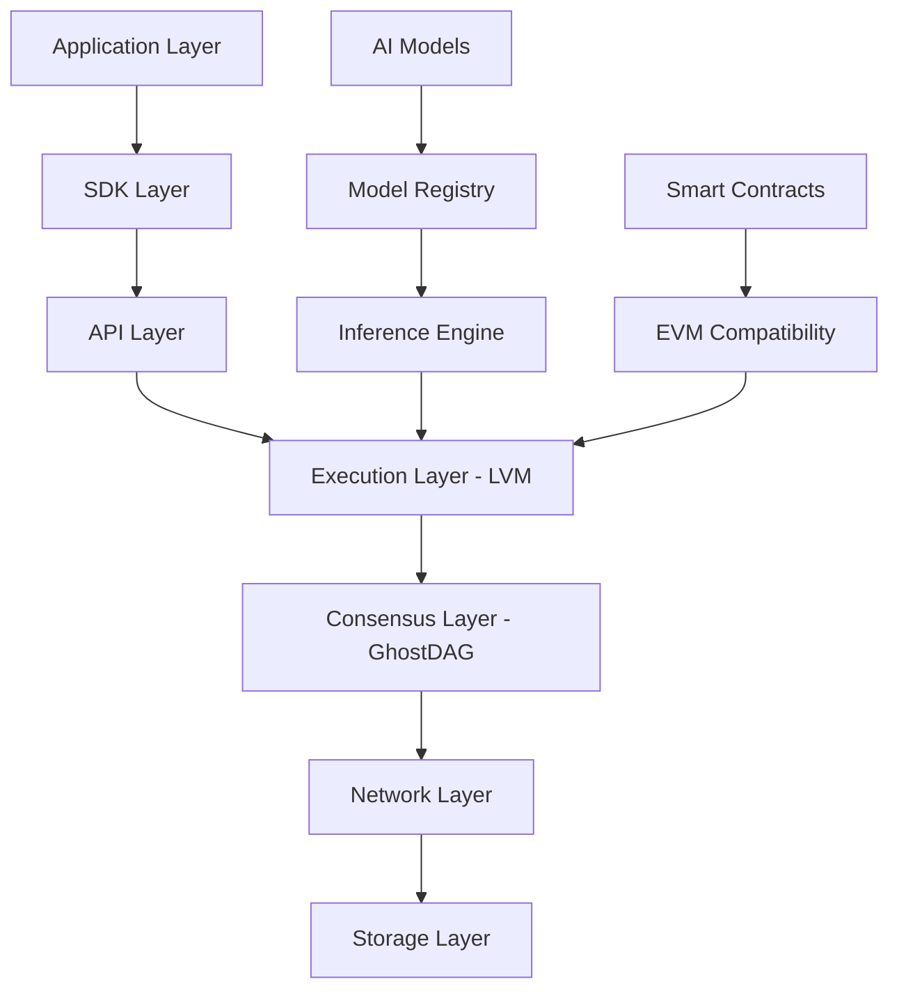

# Lattice AI Blockchain Developer Documentation

Welcome to the comprehensive developer documentation for Lattice AI Blockchain - the first AI-native Layer-1 blockchain designed specifically for artificial intelligence applications.

## What is Lattice?

Lattice is a revolutionary blockchain platform that makes AI models first-class citizens of the blockchain ecosystem. Built on a high-performance GhostDAG consensus mechanism, Lattice enables:

- **AI Model Deployment**: Deploy machine learning models directly to the blockchain
- **Decentralized Inference**: Run AI inference in a decentralized manner
- **Model Monetization**: Create marketplaces for AI models and services
- **Verifiable AI**: Ensure transparency and auditability of AI operations

## Quick Start

Get started with Lattice development in minutes:

```bash
# Install Lattice SDK
npm install lattice-js
# or
pip install lattice-sdk

# Connect to Lattice node
const client = new LatticeClient('http://localhost:8545')

# Deploy your first AI model
const result = await client.deployModel({
  modelData: modelBytes,
  metadata: { name: "My AI Model" },
  price: "1000000000000000000" // 1 ETH
})
```

## Core Features

### 🧠 **AI-Native Architecture**
- Built-in support for AI model storage and execution
- Optimized for machine learning workflows
- Native support for model versioning and governance

### ⚡ **High Performance**
- GhostDAG consensus for parallel block processing
- 10,000+ TPS throughput capability
- Sub-second block times with 12-second finality

### 🔒 **Security & Privacy**
- Advanced cryptographic protection for models
- Selective encryption and access controls
- Shamir's Secret Sharing for distributed model storage

### 🌐 **Developer Friendly**
- Multiple SDK languages (JavaScript, Python, Rust)
- Comprehensive tooling ecosystem
- EVM compatibility for smart contracts

## Development Tools

### Lattice Studio
Visual IDE for AI blockchain development with:
- Code editor with syntax highlighting
- Model deployment workflows
- Real-time network monitoring
- Integrated testing and debugging

### VS Code Extension
Professional development experience with:
- Intelligent code completion
- One-click deployment
- Integrated debugging
- Project templates

### CLI Tools
Command-line interface for:
- Node management and monitoring
- Model deployment and testing
- Network analysis and debugging
- Automated testing suites

## Architecture Overview



## Use Cases

### **AI Model Marketplace**
Create decentralized marketplaces where developers can:
- List AI models for sale or rent
- Monetize model usage through micro-payments
- Ensure model authenticity and provenance

### **Federated Learning**
Enable collaborative AI training:
- Aggregate model updates securely
- Maintain data privacy across participants
- Incentivize participation through tokenomics

### **AI-Powered DApps**
Build applications with native AI capabilities:
- Real-time inference in smart contracts
- AI-driven decision making
- Automated model selection and optimization

### **Research & Compliance**
Support AI research and regulation:
- Immutable model training logs
- Verifiable AI decision audit trails
- Compliance with AI governance frameworks

## Getting Help

- 📚 **Documentation**: Complete guides and API references
- 💬 **Discord**: Join our developer community
- 🐛 **GitHub**: Report issues and contribute
- 📧 **Support**: Direct developer support

## Next Steps

Ready to start building? Check out these resources:

1. [**Quick Start Guide**](/quickstart) - Get your first model deployed in 5 minutes
2. [**SDK Documentation**](/sdk) - Comprehensive API documentation
3. [**Tutorials**](/tutorials) - Step-by-step building guides
4. [**Examples**](/examples) - Real-world implementation examples

---

*Built by developers, for developers. Join the AI blockchain revolution with Lattice.*