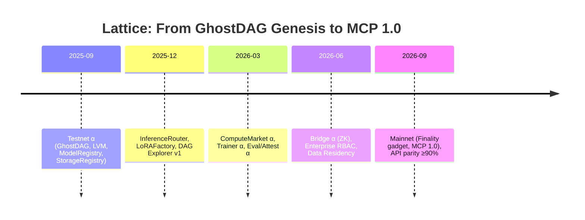

# Roadmap Visual (v3, 2025-09-06)

```mermaid
timeline
  title Lattice: From GhostDAG Genesis to MCP 1.0
  2025-09  : Testnet α (GhostDAG, LVM, ModelRegistry, StorageRegistry)
  2025-12  : InferenceRouter, LoRAFactory, DAG Explorer v1
  2026-03  : ComputeMarket α, Trainer α, Eval/Attest α
  2026-06  : Bridge α (ZK), Enterprise RBAC, Data Residency
  2026-09  : Mainnet (Finality gadget, MCP 1.0), API parity ≥90%
```
