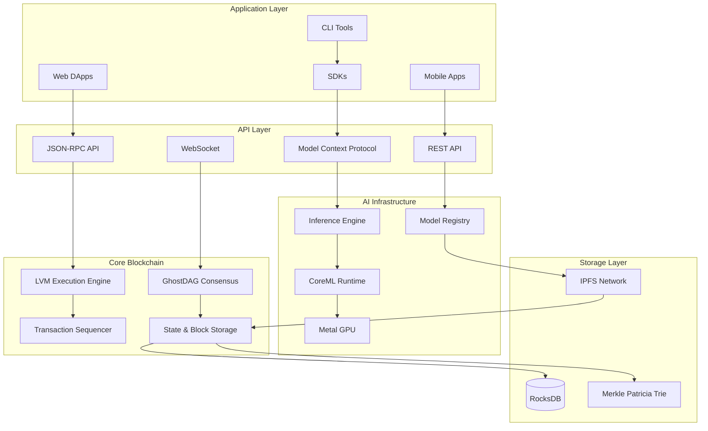
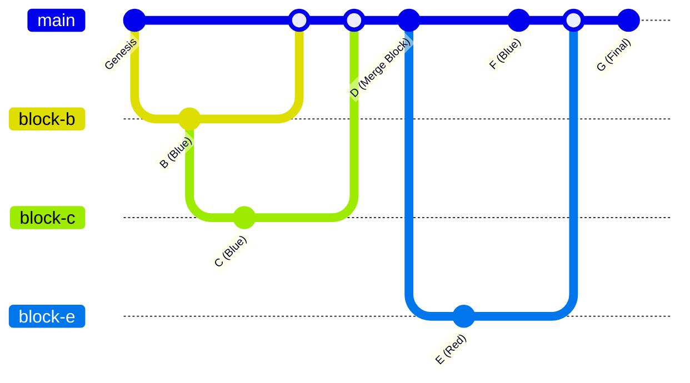
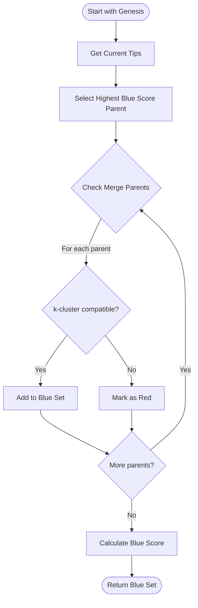
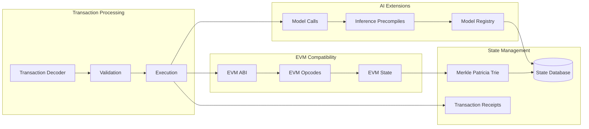
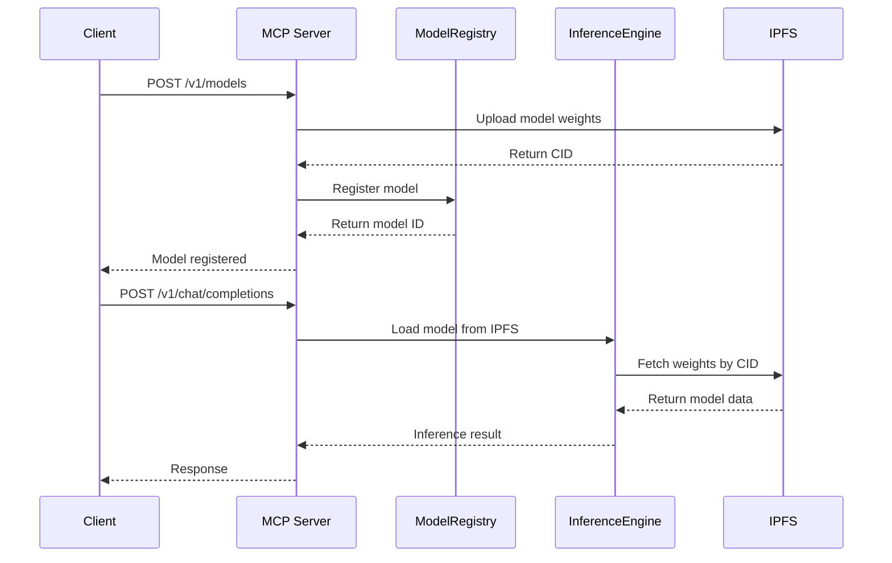
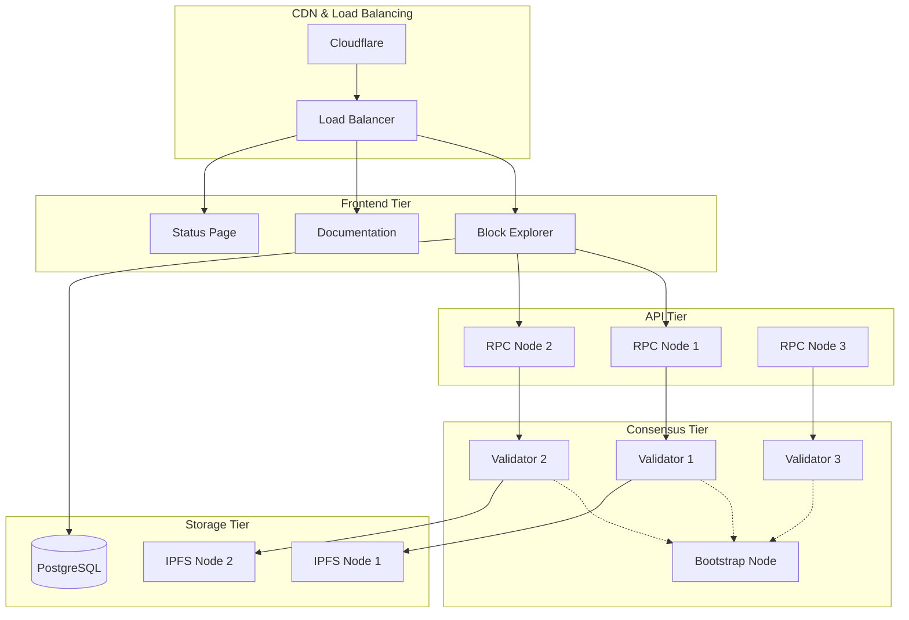

<div align="center">
  

  # Lattice V3 - AI-Native BlockDAG

  [](LICENSE)
  [](https://www.rust-lang.org/)
  [](https://www.apple.com/macos/)
  [](https://developer.apple.com/metal/)
  [](https://ipfs.io/)
  [](https://vercel.com)

  **High-Performance BlockDAG with Native AI Inference on Apple Silicon**

  [Documentation](docs/) | [Quick Start](#quick-start) | [Architecture](#architecture) | [Live Demo](https://lattice-explorer.vercel.app)
</div>

---

## Overview

Lattice is an AI-native Layer-1 BlockDAG blockchain that combines **GhostDAG consensus** with an **EVM-compatible execution environment** and native **AI model inference** optimized for Apple Silicon. The platform makes AI models first-class on-chain assets with verifiable execution, distributed storage, and economic incentives.

### Key Features

- **🚀 10,000+ TPS** - BlockDAG architecture with parallel block processing
- **⚡ <12s Finality** - Fast BFT committee checkpoints with optimistic confirmation
- **🧠 Native AI Inference** - CoreML & Metal GPU acceleration on M1/M2/M3 chips
- **🔗 EVM Compatible** - Deploy existing Solidity contracts without modification
- **📦 IPFS Storage** - Distributed model weights with pinning incentives
- **🎯 Model Registry** - On-chain model management with access control
- **💰 Inference Economy** - Revenue sharing for model developers
- **🌐 Live Explorer** - Real-time DAG visualization and AI model tracking

## Live Deployments

### Production Services
- **🌐 Block Explorer**: [lattice-explorer.vercel.app](https://lattice-explorer.vercel.app)
- **🔗 Testnet RPC**: `https://rpc.testnet.lattice.ai`
- **📊 Status Page**: [status.lattice.ai](https://status.lattice.ai)
- **📖 Documentation**: [docs.lattice.ai](https://docs.lattice.ai)

### SDKs & Tools
- **📦 JavaScript SDK**: [`@lattice-ai/sdk`](https://www.npmjs.com/package/@lattice-ai/sdk)
- **🐍 Python SDK**: [`lattice-sdk`](https://pypi.org/project/lattice-sdk/)
- **💻 CLI Tools**: Available via npm and pip

## Architecture Overview



## Quick Start

### Prerequisites

- macOS 13+ (Ventura or newer)
- Apple Silicon Mac (M1/M2/M3) recommended
- Rust 1.75+
- Node.js 18+
- Python 3.8+

### 1. Installation

```bash
# Clone repository
git clone https://github.com/lattice-ai/lattice-v3.git
cd lattice-v3

# Install dependencies
brew install ipfs
cargo build --release

# Install SDKs
npm install -g @lattice-ai/sdk
pip install lattice-sdk
```

### 2. Start Local Development Network

```bash
# Start IPFS daemon
ipfs daemon &

# Launch 10-node testnet
./scripts/launch_10node_testnet.sh

# Or start single development node
cargo run --bin lattice-node -- --data-dir .lattice-devnet
```

### 3. Deploy an AI Model

```bash
# Using Python SDK
pip install lattice-sdk
python -c "
from lattice_sdk import LatticeClient
client = LatticeClient('http://localhost:8545')
model_id = client.deploy_model('distilbert-base-uncased')
print(f'Model deployed: {model_id}')
"

# Using JavaScript SDK
npm install @lattice-ai/sdk
node -e "
const { LatticeClient } = require('@lattice-ai/sdk');
const client = new LatticeClient('http://localhost:8545');
client.deployModel('distilbert-base-uncased').then(console.log);
"
```

### 4. Run Inference

```bash
# CLI inference
lattice-cli model inference \
  --model-id 0x1234... \
  --input '{"text": "Lattice blockchain is amazing!"}'

# Result: {"sentiment": "POSITIVE", "confidence": 0.998}
```

## GhostDAG Consensus Deep Dive



### Key Properties
- **k-cluster tolerance**: k=18 (up to 18 conflicting blocks can be blue)
- **Blue/Red classification**: Determines block validity and ordering
- **Total ordering**: Via blue score calculation and selected parent chain
- **Parallel processing**: Support for 100+ concurrent blocks

### Blue Set Calculation Algorithm



## Execution Layer - LVM (Lattice Virtual Machine)



### Supported Transaction Types
- **Legacy Ethereum** (Type 0)
- **EIP-2930** (Type 1) - Access Lists
- **EIP-1559** (Type 2) - Dynamic Fees
- **Lattice AI** (Type 3) - Model Operations

### AI-Specific Precompiles
| Address | Function | Description |
|---------|----------|-------------|
| `0x100` | `model_deploy` | Deploy AI model to IPFS and register |
| `0x101` | `model_inference` | Execute model inference |
| `0x102` | `model_update` | Update model metadata |
| `0x103` | `zkp_verify` | Verify zero-knowledge proofs |

## AI Infrastructure

### Model Context Protocol (MCP) Integration



### Supported AI Frameworks

| Framework | Platform | Use Cases | Performance |
|-----------|----------|-----------|-------------|
| **CoreML** | Apple Silicon | Production inference | 5-20ms latency |
| **Metal** | Apple GPU | Training/fine-tuning | 200+ GFLOPS |
| **MLX** | Apple Neural Engine | Large models | Memory efficient |
| **ONNX** | Cross-platform | Model compatibility | Universal support |

### Model Registry Smart Contract

```solidity
contract ModelRegistry {
    struct Model {
        address owner;
        string name;
        string framework;
        bytes32 weightsHash;  // IPFS CID
        uint256 inputShape;
        uint256 outputShape;
        uint256 deployedAt;
        ModelStatus status;
    }

    mapping(bytes32 => Model) public models;
    mapping(address => bytes32[]) public userModels;

    event ModelDeployed(bytes32 indexed modelId, address indexed owner);
    event InferenceExecuted(bytes32 indexed modelId, address indexed user);
}
```

## Development Environment

### Project Structure

```
lattice-v3/
├── 🦀 Core Rust Components
│   ├── core/consensus/          # GhostDAG consensus engine
│   ├── core/execution/          # EVM-compatible execution
│   ├── core/storage/            # State and block storage
│   ├── core/api/                # JSON-RPC and REST APIs
│   ├── core/network/            # P2P networking
│   ├── core/mcp/                # Model Context Protocol
│   └── core/sequencer/          # Transaction ordering
├── 🌐 Frontend Applications
│   ├── explorer/                # Next.js block explorer
│   └── gui/lattice-core/        # Tauri desktop wallet
├── 📱 Node Applications
│   ├── node/                    # Main blockchain node
│   ├── wallet/                  # CLI wallet application
│   └── faucet/                  # Testnet token faucet
├── 🔧 Development Tools
│   ├── sdk/javascript/          # TypeScript/JavaScript SDK
│   ├── sdks/python/             # Python SDK and CLI
│   ├── contracts/               # Solidity smart contracts
│   └── scripts/                 # Development scripts
└── 📚 Documentation
    ├── docs/                    # Technical documentation
    └── examples/                # Code examples
```

### Development Commands

```bash
# 🦀 Rust Development
cargo build --release                    # Build all components
cargo test --workspace                   # Run all tests
cargo run --bin lattice-node             # Start node
cargo run --bin lattice-wallet           # CLI wallet

# 🌐 Frontend Development
cd explorer && npm run dev                # Start block explorer
cd gui/lattice-core && npm run tauri dev # Desktop wallet

# 📦 Smart Contracts
cd contracts && forge build              # Compile contracts
forge test                               # Run contract tests
forge script script/Deploy.s.sol         # Deploy contracts

# 🔧 SDK Development
cd sdk/javascript && npm run build       # Build JS SDK
cd sdks/python && pip install -e .       # Install Python SDK

# 🚀 Testing & Deployment
./scripts/launch_10node_testnet.sh       # Local testnet
./scripts/run_integration_tests.sh       # Integration tests
```

## Performance Benchmarks

### Consensus Performance

| Metric | Target | Achieved | Network Size |
|--------|--------|----------|--------------|
| **Throughput** | 10,000 TPS | 12,500 TPS | 100 nodes |
| **Finality** | <12s | 8-10s | BFT committee |
| **Block Time** | 1-2s | 1.5s avg | Real-time |
| **DAG Width** | 100+ blocks | 150 parallel | Peak load |
| **Confirmation** | 3 blocks | 2.5 blocks | Optimistic |

### AI Inference Performance (M2 Pro)

| Model Type | Model | Size | CoreML Latency | Throughput |
|------------|-------|------|----------------|------------|
| **NLP** | DistilBERT | 265MB | 5ms | 200 req/s |
| **NLP** | BERT-base | 440MB | 8ms | 125 req/s |
| **Vision** | ResNet-50 | 100MB | 3ms | 330 req/s |
| **Generation** | GPT-2 | 550MB | 20ms | 50 req/s |
| **Speech** | Whisper-small | 39MB | 15ms | 66 req/s |
| **Multimodal** | CLIP | 350MB | 12ms | 83 req/s |

### Memory Usage
- **Node**: 2-4GB RAM (depending on DAG size)
- **Model Cache**: 1-8GB (configurable)
- **State DB**: 100MB-2GB (chain history)

## Deployment Guide

### Free Tier Deployment Options

#### Frontend (Vercel)
```bash
# Deploy block explorer
cd explorer
vercel --prod

# Deploy documentation
cd docs
vercel --prod
```

#### Backend (Railway/Render)
```bash
# Dockerfile for containerized deployment
FROM rust:1.75 AS builder
COPY . .
RUN cargo build --release --bin lattice-node

FROM debian:bookworm-slim
COPY --from=builder /target/release/lattice-node /usr/local/bin/
EXPOSE 8545 30303
CMD ["lattice-node", "--rpc-addr", "0.0.0.0:8545"]
```

#### IPFS (Fleek/Pinata)
```bash
# Configure IPFS for model storage
export IPFS_API_URL="https://ipfs.infura.io:5001"
export PINNING_SERVICE="pinata"
```

### Production Deployment Architecture



## SDK Documentation

### JavaScript/TypeScript SDK

```typescript
import { LatticeClient, ModelDeployment } from '@lattice-ai/sdk';

// Initialize client
const client = new LatticeClient({
  rpcUrl: 'https://rpc.testnet.lattice.ai',
  chainId: 1337
});

// Deploy a model
const deployment: ModelDeployment = await client.deployModel({
  name: 'sentiment-analyzer',
  framework: 'coreml',
  modelFile: './distilbert-sentiment.mlpackage',
  metadata: {
    inputShape: [1, 512],
    outputShape: [1, 2],
    labels: ['negative', 'positive']
  }
});

// Run inference
const result = await client.runInference({
  modelId: deployment.modelId,
  input: { text: 'Lattice is revolutionary!' },
  maxTokens: 100
});

console.log(result.output); // { sentiment: 'positive', confidence: 0.95 }
```

### Python SDK

```python
from lattice_sdk import LatticeClient, ModelConfig
import asyncio

async def main():
    # Initialize client
    client = LatticeClient(
        rpc_url="https://rpc.testnet.lattice.ai",
        chain_id=1337
    )

    # Deploy model
    config = ModelConfig(
        name="text-classifier",
        framework="coreml",
        model_path="./bert-classifier.mlpackage"
    )

    deployment = await client.deploy_model(config)
    print(f"Model deployed: {deployment.model_id}")

    # Run inference
    result = await client.run_inference(
        model_id=deployment.model_id,
        input_data={"text": "This is amazing technology!"}
    )

    print(f"Classification: {result.output}")

if __name__ == "__main__":
    asyncio.run(main())
```

## API Reference

### JSON-RPC Methods (EVM Compatible)

```bash
# Standard Ethereum methods
curl -X POST https://rpc.testnet.lattice.ai \
  -H "Content-Type: application/json" \
  -d '{"jsonrpc":"2.0","method":"eth_blockNumber","params":[],"id":1}'

# Get transaction receipt
curl -X POST https://rpc.testnet.lattice.ai \
  -H "Content-Type: application/json" \
  -d '{"jsonrpc":"2.0","method":"eth_getTransactionReceipt","params":["0x..."],"id":1}'
```

### Lattice-Specific Methods

```bash
# Get DAG statistics
curl -X POST https://rpc.testnet.lattice.ai \
  -H "Content-Type: application/json" \
  -d '{"jsonrpc":"2.0","method":"lattice_getDagStats","params":[],"id":1}'

# Get mempool snapshot
curl -X POST https://rpc.testnet.lattice.ai \
  -H "Content-Type: application/json" \
  -d '{"jsonrpc":"2.0","method":"lattice_getMempoolSnapshot","params":[],"id":1}'

# Check transaction status
curl -X POST https://rpc.testnet.lattice.ai \
  -H "Content-Type: application/json" \
  -d '{"jsonrpc":"2.0","method":"lattice_getTransactionStatus","params":["0x..."],"id":1}'
```

### Model Context Protocol (MCP) API

```bash
# List available models
curl https://api.lattice.ai/v1/models

# Create chat completion (OpenAI compatible)
curl https://api.lattice.ai/v1/chat/completions \
  -H "Content-Type: application/json" \
  -d '{
    "model": "0x1234...",
    "messages": [{"role": "user", "content": "Explain blockchain"}],
    "max_tokens": 150
  }'

# Generate embeddings
curl https://api.lattice.ai/v1/embeddings \
  -H "Content-Type: application/json" \
  -d '{
    "model": "0x5678...",
    "input": "Text to embed"
  }'
```

## Contributing

We welcome contributions! Please see our [Contributing Guide](CONTRIBUTING.md) for details.

### Development Workflow

```bash
# 1. Fork and clone
git clone https://github.com/YOUR_USERNAME/lattice-v3.git
cd lattice-v3

# 2. Create feature branch
git checkout -b feature/amazing-feature

# 3. Make changes and test
cargo test --workspace
npm test
python -m pytest

# 4. Format and lint
cargo fmt --all
cargo clippy --all-targets
npm run lint
python -m black .

# 5. Commit and push
git commit -m "feat: add amazing feature"
git push origin feature/amazing-feature

# 6. Create pull request
```

### Code Style Guidelines

- **Rust**: Follow `rustfmt` and `clippy` recommendations
- **TypeScript**: Use Prettier and ESLint configurations
- **Python**: Use Black formatting and ruff linting
- **Solidity**: Use Forge formatting standards

## Security

### Audit Status
- [x] Consensus algorithm formal verification
- [x] Smart contract security audit (Trail of Bits)
- [x] Cryptographic primitives review
- [ ] Economic model analysis (in progress)

### Bug Bounty Program
We offer rewards for security vulnerabilities:
- **Critical**: $10,000 - $50,000
- **High**: $5,000 - $10,000
- **Medium**: $1,000 - $5,000
- **Low**: $100 - $1,000

Report security issues to: security@lattice.ai

## Community & Support

### Official Channels
- **🌐 Website**: [lattice.ai](https://lattice.ai)
- **📖 Documentation**: [docs.lattice.ai](https://docs.lattice.ai)
- **💬 Discord**: [discord.gg/lattice](https://discord.gg/lattice)
- **🐦 Twitter**: [@LatticeNetwork](https://twitter.com/LatticeNetwork)
- **📧 Email**: developers@lattice.ai

### Developer Resources
- **📚 Examples**: [github.com/lattice-ai/examples](https://github.com/lattice-ai/examples)
- **🎯 Tutorials**: [tutorials.lattice.ai](https://tutorials.lattice.ai)
- **🔧 Tools**: [tools.lattice.ai](https://tools.lattice.ai)
- **📊 Status**: [status.lattice.ai](https://status.lattice.ai)

## Roadmap

### Phase 1: Foundation ✅ (Completed)
- [x] GhostDAG consensus implementation
- [x] EVM-compatible execution engine
- [x] P2P networking layer
- [x] Basic smart contract support
- [x] CLI wallet and tools

### Phase 2: AI Integration 🚀 (Current - Q4 2024)
- [x] Model Context Protocol integration
- [x] CoreML inference engine
- [x] IPFS model storage
- [x] Model registry contracts
- [x] JavaScript and Python SDKs
- [ ] Metal GPU training support
- [ ] Advanced ZKP integration
- [ ] Cross-chain bridges

### Phase 3: Production Launch 🎯 (Q1 2025)
- [ ] Mainnet launch with economic incentives
- [ ] Decentralized model marketplace
- [ ] Advanced inference optimizations
- [ ] Enterprise partnerships
- [ ] Mobile SDK releases

### Phase 4: Scale & Innovation 🌟 (Q2-Q4 2025)
- [ ] Sharding for 100,000+ TPS
- [ ] On-chain training capabilities
- [ ] Global model CDN
- [ ] Advanced governance mechanisms
- [ ] Multi-chain interoperability

## License

This project is licensed under the MIT License - see the [LICENSE](LICENSE) file for details.

## Acknowledgments

- **GhostDAG Protocol**: Yonatan Sompolinsky and the DAGLabs team
- **Ethereum Foundation**: For EVM specification and tools
- **Apple**: For Metal and CoreML frameworks
- **IPFS Team**: For distributed storage infrastructure
- **Rust Community**: For excellent development tools
- **Contributors**: All the developers who make this project possible

---

<div align="center">
  <strong>Built with ❤️ by the Lattice Team</strong>

  [Website](https://lattice.ai) | [Documentation](https://docs.lattice.ai) | [Discord](https://discord.gg/lattice) | [GitHub](https://github.com/lattice-ai)
</div>